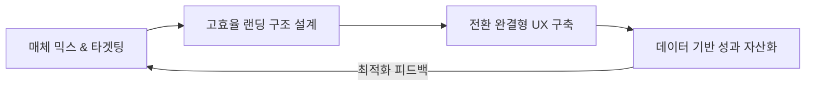
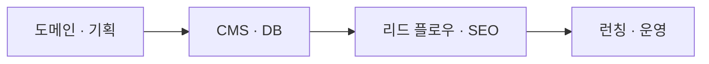

# 이세영

# Growth Marketing Lead · Strategy, Web & Automation

## Core Results
* 연간 316.4만 세션 달성 (+104%) 및 1,078% 전환 폭증 (양식 제출 17,063건 확보)
* Meta(FB/IG) 유료 검색 유입 약 1,000% 증가 견인 및 매체 믹스 최적화
* 신규 방문자 비중 94% 달성 및 수도권 핵심 타겟 페르소나 집중 공략
* 10년+ 마케팅 전략 수립 및 리드 파이프라인 시스템 자동화 경력 (연간 8~15억 규모의 광고 예산 운용 및 최적화 경험)

> [Full Performance Report (2025)](reports/2025-website-performance.md) — 채널별 성과, 전환 퍼널, 핵심 인사이트 상세 분석
>
> [CRO Strategy (2025)](reports/2025-cro-strategy.md) — 데이터 기반 UX 및 전환율 최적화 전략

---

## What I Do
**최적의 매체 믹스와 완결형 UX의 결합으로 성과를 자산화합니다.**

단순히 광고 예산을 집행하는 것에 그치지 않고, 투입된 비용이 비즈니스의 실질적인 리드(Lead)로 전환될 수 있도록 '매체-랜딩-전환'의 전 과정을 유기적으로 정렬합니다. 특히 2025년 한 해 동안 98%에 달하는 모바일 환경에 맞춘 전용 랜딩 페이지를 구축하여, 트래픽 증가분보다 훨씬 가파른 10배 이상의 전환 성장을 이끌어냈습니다.

광고 클릭 직후 발생하는 91%의 반송률을 분석하여 목적 지향적인 '/livesteno' 앵커 페이지와 같은 구조적 해법을 제시합니다. 사용자가 정보를 탐색하는 수고를 덜고 즉각적인 신청과 구입으로 이어지도록 **직관적인 CTA(행동 유도 버튼)**를 배치하여 전환의 질을 극대화했습니다. 예산은 성장의 연료일 뿐, 그 연료를 가장 완벽하게 성과로 태워내는 '고성능 엔진'과 같은 시스템을 만드는 것이 저의 역할입니다.

---

## How I Work

| 분석 기반 기획 | 웹사이트 풀스택 운영 | AI 자동화 설계 |
|:---:|:---:|:---:|
| 유입 가설 검증 및 최적화 | 매끄러운 고객 여정 설계 | 반복 업무 제거 및 운영 효율화 |

---

## Featured Work

### Timblo

> AI 회의록 SaaS · SK hynix & SK telecom 공동 서비스 오픈 · 마케팅 협업

| 문제 | 해결 |
|---|---|
| B2B/B2C 채널이 분산되어 있고 앱·웹·스토어 메시지가 일관되지 않음 | 웹·앱·스토어를 아우르는 통합 커뮤니케이션 구조와 채널별 전환 흐름 설계 |

[timblo.io](https://timblo.io/ko) · [Google Play](https://play.google.com/store/apps/details?id=net.timblo.mobile.aos)

---

### WebScout

> 자체 구축 분석 도구 · Next.js · Vercel

| 문제 | 해결 |
|---|---|
| 경쟁사 사이트 구조와 SEO 기회를 파악하는 데 많은 시간이 소요됨 | 자동 크롤링 기반으로 IA·SEO 클러스터를 시각화해 분석 시간을 대폭 단축 |

[Live Demo](https://webscout-next-8veo.vercel.app/) · [GitHub](https://github.com/dalgoms/webscout-next)

---

### SORIZAVA

> 핵심 매출 서비스 · AI 속기사 인지 확보 · 풀퍼널 마케팅 

| 문제 | 해결 |
|---|---|
| 레거시 서비스 구조로 인해 리드와 전환 효율의 정체 | UTM 기반 A/B 테스트 시스템 구축, 전환 병목를 재정비해 리드 확장 재설계 |

[sorizava.com](https://www.sorizava.com/) · [Performance Report](reports/2025-website-performance.md) · [CRO Strategy](reports/2025-cro-strategy.md)

---

### Ad Creative Tool

> 광고 크리에이티브 자동화 시스템 · Next.js · GPT-4o · Supabase

| 문제 | 해결 |
|---|---|
| 플랫폼별 광고 소재를 수작업으로 반복 제작 | AI 카피 생성, 템플릿 렌더링, 멀티사이즈 자동화를 결합한 제작 시스템 구축 |

[Live](https://ad-creative-tool.vercel.app) · [GitHub](https://github.com/dalgoms/ad-creative-tool)

---

## Websites & Service Operations

8개 프로퍼티를 동시에 기획·운영한 경험.

| 분류 | 사이트 | 설명 | 역할 |
|---|---|---|---|
| 기업 | [timbel.net](https://www.timbel.net/) | AI 음성 플랫폼 · B2B 서비스 허브 | 웹 기획 · 메시지 정리 · 리드 구조 · CMS 운영 |
| 서비스 | [sorizava.com](https://www.sorizava.com/) | 속기 키보드 서비스 · AI 속기사 홍보 | SEO · 전환 구조 · 운영 최적화 |
| 서비스 | [clipdesk.net](https://www.clipdesk.net/) | 영상 편집 서비스 · 크리에이터/기업 대상 | 런칭 지원 · 서비스 기획 · 커뮤니케이션 |
| 콘텐츠 | [textarbiz.com](https://www.textarbiz.com/) | 자막/번역 서비스 · 글로벌사업부 | 서비스 커뮤니케이션 · 구조 정리 |
| 글로벌 | [textarglobal.com](https://www.textarglobal.com/) | 글로벌 자막 서비스 · AI+Human workflow | 글로벌 커뮤니케이션 · 서비스 운영 지원 |
| 플랫폼 | [worksfy.net](https://www.worksfy.net/) | 속기사 매칭 플랫폼 | 운영 구조 · 서비스 흐름 지원 |
| SaaS | [timblo.io](https://timblo.io/ko) |  AI 회의록 SaaS · 250+ 기업 고객 | 제품 커뮤니케이션 · B2B 구조 설계 |
| App | [Timblo App](https://play.google.com/store/apps/details?id=net.timblo.mobile.aos) | AI 회의 녹음·요약 앱 | 앱 연계 커뮤니케이션 · 서비스 운영 지원 |

---

## AI Automation

| Status | 프로젝트 | 문제 | 해결 |
|---|---|---|---|
| LIVE | [WebScout](https://webscout-next-8veo.vercel.app/) | 경쟁사 구조와 SEO 기회 분석에 많은 시간이 소요됨 | 자동 크롤링과 시각화를 통해 분석 시간을 대폭 단축 |
| LIVE | [Ad Creative Tool](https://ad-creative-tool.vercel.app) | 플랫폼별 광고 소재를 수작업으로 반복 제작 | AI 카피 변형과 자동화로 제작 시간 절감 |
| LIVE | [MEFIMAKE](https://mefimake.vercel.app/) | 광고 소재 제작 흐름이 수작업 중심이었음 | AI 카피 변형 + 시간 절감 |
| INT | Biz Automation | 리드 관리부터 팔로업까지 수동 업무 비중이 높았음 | Make.com과 Notion CRM 기반 자동화 흐름 구축|

---

## Tech & Tools

| 분류 | 기술 | 역할 |
|---|---|---|
| Website Ops | Wix · SEO · GA | 도메인·CMS·DB·폼·리드 플로우 운영 |
| AI / Automation | GPT · Claude · Make.com · Notion API | 카피 생성·워크플로우·리드 자동화 |
| Dev | Next.js · TypeScript · Vercel | 내부 도구·분석 시스템 구축 |
| Design | Figma · PS · AI · Premiere | 기획 시각화·소재 제작 |
| Analysis | UTM · A/B · 퍼널 분석 | 성과 측정·전환 최적화 |
| Messaging | Telegram Bot · Gmail · KakaoTalk | 자동 알림·팔로업 |

---

## Contact

Growth Marketing, Website Ops, CRM, AI Automation 분야의 기회에 열려 있습니다.

**Email** seyoung8967@gmail.com · **LinkedIn** [linkedin.com/in/seyounglees](https://www.linkedin.com/in/seyounglees/)
