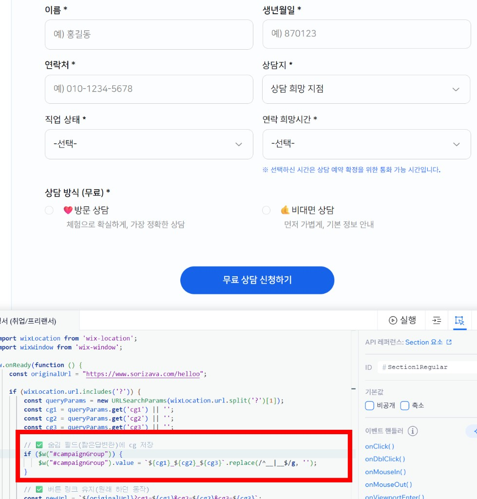
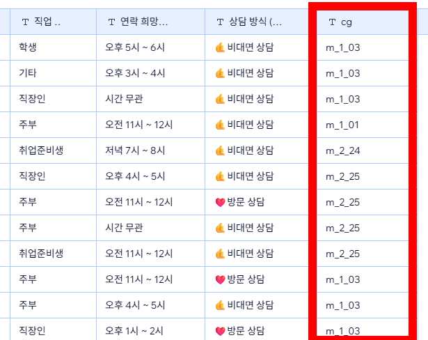
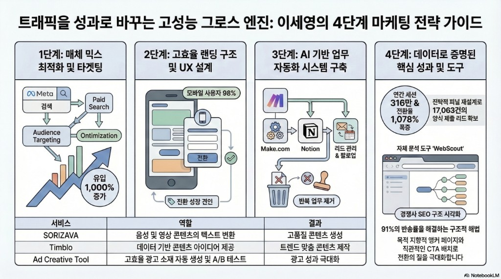
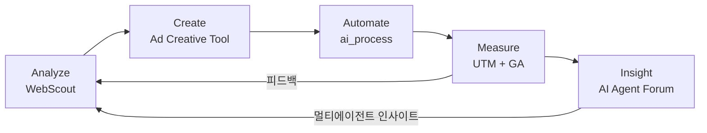
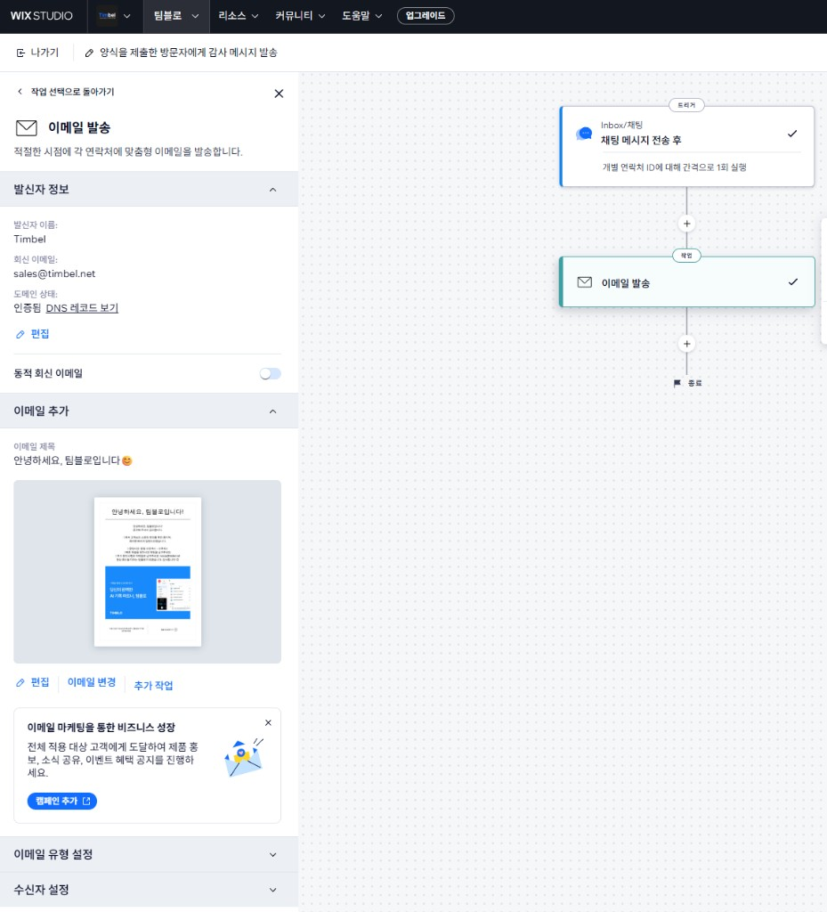

# 이세영
### 그로스 마케터 · AI 제품 · 웹/자동화 직접 구축

**한국어** | [English](README_EN.md)

**팀벨(timbel)** · 홍보마케팅 팀장 · 10년+

속기 전문 기업이 AI 음성인식 기술 기업으로 전환되는 10년의 여정 속에서, 제품의 변화에 맞춰 마케팅 시스템을 0부터 직접 구축해왔습니다. 단순히 광고를 집행하는 것에 그치지 않고, 웹사이트 빌딩, 독자적인 데이터 트래킹 시스템(UTM + Velo), AI 자동화 워크플로우를 코드로 직접 구현하여 비즈니스의 병목을 해결합니다.

> **14x** 리드 성장 · **650%** ROAS · **1,078%** 전환 증가 · **₩72억** 매출 · **250+** 기업 고객 · **8** 웹사이트 운영

---

## 핵심 성과

* 연 **8~15억** 광고 예산을 Meta, Google, 네이버에서 운영 (10년 연속)
* 매출 **52억 → 72억**, **ROAS 650%**
* 트래픽 2배 증가 대비 전환 **1,078% 증가** (양식 제출 17,063건)
* 자체 어트리뷰션 추적 설계 (UTM + 숨김 필드 + Wix Velo) → 소재별 리드 품질 분석 → A/B 테스트로 퍼널 개선
* SK hynix · SK Telecom 공동 AI SaaS 런칭, 매출 **11억**
* 5개 이상 사업부(STT, 미디어자막, 영상편집, 번역) 마케팅 총괄
* 10명+ 다직군 팀을 소규모 유닛에서 독립 부서로 성장

> [성과 리포트 (2025)](reports/2025-website-performance.md) — 채널별 성과, 전환 퍼널, 핵심 인사이트
>
> [CRO 전략 (2025)](reports/2025-cro-strategy.md) — 데이터 기반 UX 및 전환율 최적화

---

## 직접 만든 것들

### WebScout — 경쟁사 사이트 분석 자동화

경쟁사 사이트를 하나하나 뜯어보는 데 시간이 너무 많이 들어서 직접 만들었습니다. URL을 넣으면 사이트 구조를 크롤링하고 GPT-4o가 진단 리포트를 생성합니다.

[Live Demo](https://webscout-next.vercel.app/) · Next.js, TypeScript, Vercel

### Ad Creative Tool — 광고 소재 자동화 `진행중`

플랫폼별로 소재를 일일이 만드는 반복 작업이 싫어서 만들었습니다. AI가 카피를 쓰고, 템플릿에 렌더링하고, 여러 사이즈로 내보냅니다.

[Live](https://ad-creative-tool.vercel.app) · [GitHub](https://github.com/dalgoms/ad-creative-tool) · Next.js, GPT-4o, Supabase

### AI Agent Forum — 멀티에이전트 토론 워크스페이스

단일 AI의 관점 편향이 아쉬워서 만들었습니다. 시장분석가·경쟁분석가·영업전략가 3명의 AI 에이전트가 독립 분석 후 교차 토론하며 다각적 인사이트를 도출합니다. 데모 모드($0)와 라이브 모드(메가프롬프트 1회)의 듀얼 구조.

[Live](https://mefimake.vercel.app) · [GitHub](https://github.com/dalgoms/agent-forum) · Next.js, OpenAI, Vercel

### 리드 자동화 시스템

Wix CMS로 리드를 받아서 Notion으로 넘기고, AI 에이전트가 반복 업무(데이터 보강, 태깅, 팔로업)를 처리합니다. 사람은 분석과 클로징에 집중하는 구조입니다.

Make.com, Notion API, GitHub Actions

---

## 주요 서비스 마케팅

### SORIZAVA

> 핵심 매출 서비스 · AI 속기사 인지 확보 · 풀퍼널 마케팅

| 문제 | 해결 |
|---|---|
| 레거시 서비스 구조로 리드·전환 효율 정체 | UTM 기반 A/B 테스트 시스템 구축, 전환 구조 재설계 |

광고에 UTM 코드를 직접 설계해서, 어떤 채널·소재·키워드로 유입됐는지 양식에 자동으로 기록되게 만들었습니다. Wix 폼 + 숨김 필드 + Velo 코드를 조합한 추적 시스템으로, 상담 부서가 고객의 관심사와 유입 맥락을 미리 알 수 있게 했습니다.

UTM 추적 시스템 상세

 

[sorizava.com](https://www.sorizava.com/) · [성과 리포트](reports/2025-website-performance.md) · [CRO 전략](reports/2025-cro-strategy.md)

---

### Timblo — AI 회의록 SaaS

> B2B SaaS · 250+ 기업 고객 · SK hynix & SK Telecom 공동 런칭

| 문제 | 해결 |
|---|---|
| B2B/B2C 채널 분산, 앱·웹·스토어 메시지 불일치 | 통합 커뮤니케이션 구조 + 채널별 전환 흐름 설계 |

제품 포지셔닝부터 세그먼트별 메시지 분리, B2B 온보딩, 영업 자료까지 GTM 전반을 직접 설계하고 실행했습니다.

[timblo.io](https://timblo.io/ko) · [Google Play](https://play.google.com/store/apps/details?id=net.timblo.mobile.aos)

---

## 어떻게 일하는지

광고비가 실제 리드로 이어지려면 매체 → 랜딩 → 전환까지 전 과정이 맞물려야 합니다. 98% 모바일 환경에 맞춘 전용 랜딩페이지를 만들고, 91% 반송률을 해결하는 앵커 페이지를 설계해서, 트래픽 2배 대비 전환 10배 성장을 만들었습니다.

---

## Growth Marketing OS

직접 만든 도구들이 분석 → 제작 → 자동화 → 측정으로 이어지는 하나의 시스템입니다.

| Phase | 도구 | 역할 | 상태 |
|---|---|---|---|
| **Analyze** | [WebScout](https://webscout-next.vercel.app/) | 사이트 구조 크롤링 · AI 진단 리포트 | LIVE |
| **Create** | [Ad Creative Tool](https://ad-creative-tool.vercel.app) | AI 카피 생성 · 멀티사이즈 자동화 | 진행중 |
| **Automate** | [ai_process](https://github.com/dalgoms/ai_process) | Notion→GitHub 파이프라인 · CRM 자동화 | LIVE |
| **Measure** | UTM + GA + Wix | 채널별 전환 추적 · 퍼널 분석 | LIVE |
| **Insight** | [AI Agent Forum](https://mefimake.vercel.app) | 멀티에이전트 토론 기반 시장·경쟁·세일즈 인사이트 | LIVE |

> 5개 단계 모두 직접 만들었고, 실제 업무에서 쓰고 있습니다.

---

## 웹사이트 운영

8개 사이트를 동시에 기획·운영하면서, 각 서비스별 리드 파이프라인을 자동화로 구축했습니다. 고객이 문의하면 세그먼트별 소개서가 자동 발송되고, 각 부서로 리드가 분배되는 구조입니다.

리드 자동화 상세

 

| 분류 | 사이트 | 설명 | 역할 |
|---|---|---|---|
| 기업 | [timbel.net](https://www.timbel.net/) | AI 음성 플랫폼 · B2B 서비스 허브 | 웹 기획 · 리드 구조 · CMS 운영 |
| 서비스 | [sorizava.com](https://www.sorizava.com/) | 속기 서비스 · AI 속기사 | SEO · 전환 구조 · 최적화 |
| 서비스 | [clipdesk.net](https://www.clipdesk.net/) | 영상 편집 서비스 | 런칭 · 서비스 기획 |
| 콘텐츠 | [textarbiz.com](https://www.textarbiz.com/) | 자막/번역 서비스 | 커뮤니케이션 · 구조 정리 |
| 글로벌 | [textarglobal.com](https://www.textarglobal.com/) | 글로벌 자막 서비스 | 글로벌 커뮤니케이션 |
| 플랫폼 | [worksfy.net](https://www.worksfy.net/) | 속기사 매칭 플랫폼 | 운영 구조 |
| SaaS | [timblo.io](https://timblo.io/ko) | AI 회의록 SaaS · 250+ 기업 고객 | 제품 커뮤니케이션 · B2B 설계 |
| App | [Timblo App](https://play.google.com/store/apps/details?id=net.timblo.mobile.aos) | AI 회의 녹음·요약 앱 | 앱 커뮤니케이션 |

---

## 기술 스택

| 분류 | 기술 | 용도 |
|---|---|---|
| Website Ops | Wix · SEO · GA4 | 도메인·CMS·DB·폼·리드 플로우 |
| AI / Automation | GPT · Claude · Cursor · Make.com · Notion API | 카피 생성·워크플로우·리드 자동화 |
| Dev | Next.js · TypeScript · Node.js · Vercel | AI 도구·분석 시스템 |
| Design | Figma · PS · AI · Premiere | 기획 시각화·소재 제작 |
| Analysis | UTM · A/B Testing · 퍼널 분석 | 성과 측정·전환 최적화 |
| Messaging | Telegram Bot · Slack · Gmail · KakaoTalk | 자동 알림·팔로업 |

---

## 연락처

**AI SaaS · Growth Marketing · B2B · 마케팅 자동화** 관련 기회에 열려 있습니다.

**Email** seyoung8967@gmail.com · **LinkedIn** [linkedin.com/in/seyounglees](https://www.linkedin.com/in/seyounglees/)
