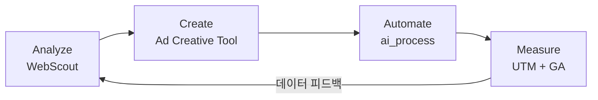

# 이세영
### Growth Marketing Lead · AI SaaS · B2B/B2C · Builder

**한국어** | [English](README_EN.md)

**팀벨(Timbel)** · 홍보 마케팅 팀장 · 10년+

전략을 세우고, 구조를 만들고, **직접 코드로 실행합니다.**

마케팅 성과를 만드는 것에서 끝나지 않고, 성과를 만드는 **시스템 자체를 직접 설계하고 빌드**하는 마케터입니다.
10년간 연간 8~15억 규모의 멀티채널 캠페인을 운영하며, AI 제품의 B2B/B2C 성장을 이끌었습니다.

> **14x** 리드 성장 · **650%** ROAS · **1,078%** 전환 폭증 · **₩72억** 매출 · **250+** B2B 기업 고객 · **8** 라이브 서비스 운영

---

## Why Me — 3가지 차별점

### 1. 한국 시장을 아는 AI 마케터
10년간 네이버·카카오·메타·구글 한국 시장에서 실전 운영. 한국 B2B 구매 프로세스, 미디어 생태계, 규제 환경을 체화한 실행 역량.

### 2. 직접 만드는 마케터 (Builder Marketer)
마케팅 병목을 발견하면 코드로 해결합니다. AI 기반 경쟁사 분석 도구, 광고 소재 자동화 시스템, 리드 관리 파이프라인을 직접 설계·개발·배포.

### 3. 검증된 풀퍼널 성과
유입에서 전환까지 전 과정을 설계. 트래픽 2배 성장 대비 전환 10배 성장이라는 구조적 성과를 만들어냈습니다.

---

## Core Results

* 연간 **8~15억 규모** 광고 예산 운용, 매체 믹스 최적화 (10년+ 연속)
* 매출 **52억 → 72억** 성장, **ROAS 650%** 달성
* 연간 **316.4만 세션** (+104% YoY) 및 **1,078% 전환 폭증** (양식 제출 17,063건)
* Meta(FB/IG) 유료 검색 유입 약 **1,000% 증가** 견인
* SK hynix · SK Telecom 공동 AI SaaS 서비스 런칭, **매출 11억** 달성
* 10명+ 규모 다직군 팀 리드 · 전 부서 협업 총괄

> [Full Performance Report (2025)](reports/2025-website-performance.md) — 채널별 성과, 전환 퍼널, 핵심 인사이트 상세 분석
>
> [CRO Strategy (2025)](reports/2025-cro-strategy.md) — 데이터 기반 UX 및 전환율 최적화 전략

---

## Featured Work

### SORIZAVA

> 핵심 매출 서비스 · AI 속기사 인지 확보 · 풀퍼널 마케팅

| 문제 | 해결 |
|---|---|
| 레거시 서비스 구조로 인해 리드와 전환 효율의 정체 | UTM 기반 A/B 테스트 시스템 구축, 전환 병목을 재정비해 리드 확장 재설계 |

광고 세팅 시 UTM 코드를 직접 설계하여, 어떤 채널·소재·키워드를 통해 유입되었는지 양식 제출 데이터에 자동 기록되도록 구축. Wix 폼 + 숨김 필드 + Velo 코드를 조합한 엔드투엔드 추적 시스템으로, 상담 전환 부서에 고객의 관심사와 유입 맥락을 사전 전달하여 상담 품질을 높였다.

UTM 추적 시스템 상세 보기

 

[sorizava.com](https://www.sorizava.com/) · [Performance Report](reports/2025-website-performance.md) · [CRO Strategy](reports/2025-cro-strategy.md)

---

### Timblo — AI 회의록 SaaS

> B2B SaaS · 250+ 기업 고객 · SK hynix & SK Telecom 공동 런칭

| 문제 | 해결 |
|---|---|
| B2B/B2C 채널이 분산되어 있고 앱·웹·스토어 메시지가 일관되지 않음 | 웹·앱·스토어를 아우르는 통합 커뮤니케이션 구조와 채널별 전환 흐름 설계 |

제품 포지셔닝부터 세그먼트별(SMB·미드마켓·엔터프라이즈) 메시지 분리, B2B 온보딩 플로우, 영업 지원 자료까지 GTM 전반을 설계·실행.

[timblo.io](https://timblo.io/ko) · [Google Play](https://play.google.com/store/apps/details?id=net.timblo.mobile.aos)

---

### WebScout — 경쟁사 인텔리전스 자동화

> 자체 구축 · Next.js · Vercel · GPT-4o · 프로덕션 배포 완료

| 문제 | 해결 |
|---|---|
| 경쟁사 사이트 구조와 SEO 기회를 파악하는 데 많은 시간이 소요됨 | 자동 크롤링 + GPT-4o 기반 AI 진단 리포트로 구조 분석부터 성장 기회 도출까지 자동화 |

[Live Demo](https://webscout-next.vercel.app/) · [GitHub](https://github.com/dalgoms/webscout-next)

---

### Ad Creative Tool — 광고 소재 자동화

> 자체 구축 · Next.js · GPT-4o · Supabase · 프로덕션 배포 완료

| 문제 | 해결 |
|---|---|
| 플랫폼별 광고 소재를 수작업으로 반복 제작 | AI 카피 생성, 템플릿 렌더링, 멀티사이즈 자동화를 결합한 제작 시스템 구축 |

[Live](https://ad-creative-tool.vercel.app) · [GitHub](https://github.com/dalgoms/ad-creative-tool)

---

## What I Do

**최적의 매체 믹스와 완결형 UX의 결합으로 성과를 자산화합니다.**

투입된 비용이 비즈니스의 실질적인 리드(Lead)로 전환될 수 있도록 '매체-랜딩-전환'의 전 과정을 유기적으로 정렬합니다. 98% 모바일 환경에 맞춘 전용 랜딩 페이지 구축과 91% 반송률을 해결하는 앵커 페이지 설계로, 트래픽 2배 성장 대비 10배의 전환 성장을 이끌어냈습니다.

---

## Growth Marketing OS

분석부터 크리에이티브, 실행, 측정까지 — 직접 구축한 도구들이 하나의 마케팅 운영 시스템으로 연결됩니다.

| Phase | 도구 | 역할 | 상태 |
|---|---|---|---|
| **Analyze** | [WebScout](https://webscout-next.vercel.app/) | 사이트 구조 크롤링 · IA/SEO 시각화 · AI 진단 리포트 | LIVE |
| **Create** | [Ad Creative Tool](https://ad-creative-tool.vercel.app) | AI 카피 생성 · 멀티사이즈 자동화 | LIVE |
| **Automate** | [ai_process](https://github.com/dalgoms/ai_process) | Notion→GitHub→배포 파이프라인 · CRM 자동화 | LIVE |
| **Measure** | UTM + GA + Wix | 채널별 전환 추적 · 퍼널 분석 | LIVE |

> 4개 단계 모두 직접 설계·개발했으며, 실제 업무에서 운용 중인 시스템입니다.

---

## Websites & Service Operations

8개 프로퍼티를 동시에 기획·운영하며, 각 서비스의 리드 파이프라인을 자동화 시스템으로 구축.

홈페이지 구축 후 고객 세그먼트별 서비스 소개서를 자동 발송하는 오토메이션을 설계하고, 각 부서장에게 배포하여 자율 운영 체계를 구축했다. 전사 리드는 대표 메일에서 통합 모니터링, 개별 부서 메일로 분산 대응이 동시에 가능한 구조.

리드 자동화 오토메이션 상세 보기

 

| 분류 | 사이트 | 설명 | 역할 |
|---|---|---|---|
| 기업 | [timbel.net](https://www.timbel.net/) | AI 음성 플랫폼 · B2B 서비스 허브 | 웹 기획 · 메시지 정리 · 리드 구조 · CMS 운영 |
| 서비스 | [sorizava.com](https://www.sorizava.com/) | 속기 키보드 서비스 · AI 속기사 홍보 | SEO · 전환 구조 · 운영 최적화 |
| 서비스 | [clipdesk.net](https://www.clipdesk.net/) | 영상 편집 서비스 · 크리에이터/기업 대상 | 런칭 지원 · 서비스 기획 · 커뮤니케이션 |
| 콘텐츠 | [textarbiz.com](https://www.textarbiz.com/) | 자막/번역 서비스 · 글로벌사업부 | 서비스 커뮤니케이션 · 구조 정리 |
| 글로벌 | [textarglobal.com](https://www.textarglobal.com/) | 글로벌 자막 서비스 · AI+Human workflow | 글로벌 커뮤니케이션 · 서비스 운영 지원 |
| 플랫폼 | [worksfy.net](https://www.worksfy.net/) | 속기사 매칭 플랫폼 | 운영 구조 · 서비스 흐름 지원 |
| SaaS | [timblo.io](https://timblo.io/ko) | AI 회의록 SaaS · 250+ 기업 고객 | 제품 커뮤니케이션 · B2B 구조 설계 |
| App | [Timblo App](https://play.google.com/store/apps/details?id=net.timblo.mobile.aos) | AI 회의 녹음·요약 앱 | 앱 연계 커뮤니케이션 · 서비스 운영 지원 |

---

## Tech & Tools

| 분류 | 기술 | 역할 |
|---|---|---|
| Website Ops | Wix · SEO · GA4 | 도메인·CMS·DB·폼·리드 플로우 운영 |
| AI / Automation | GPT · Claude · Cursor · Make.com · Notion API | 카피 생성·워크플로우·리드 자동화 |
| Dev | Next.js · TypeScript · Node.js · Vercel | AI 도구·분석 시스템 구축 |
| Design | Figma · PS · AI · Premiere | 기획 시각화·소재 제작 |
| Analysis | UTM · A/B Testing · 퍼널 분석 | 성과 측정·전환 최적화 |
| Messaging | Telegram Bot · Slack · Gmail · KakaoTalk | 자동 알림·팔로업 |

---

## Contact

**AI SaaS · Growth Marketing · B2B Demand Gen · 마케팅 자동화** 분야의 기회에 열려 있습니다.

**Email** seyoung8967@gmail.com · **LinkedIn** [linkedin.com/in/seyounglees](https://www.linkedin.com/in/seyounglees/)
