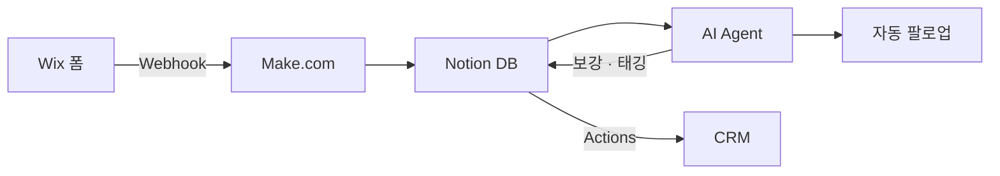
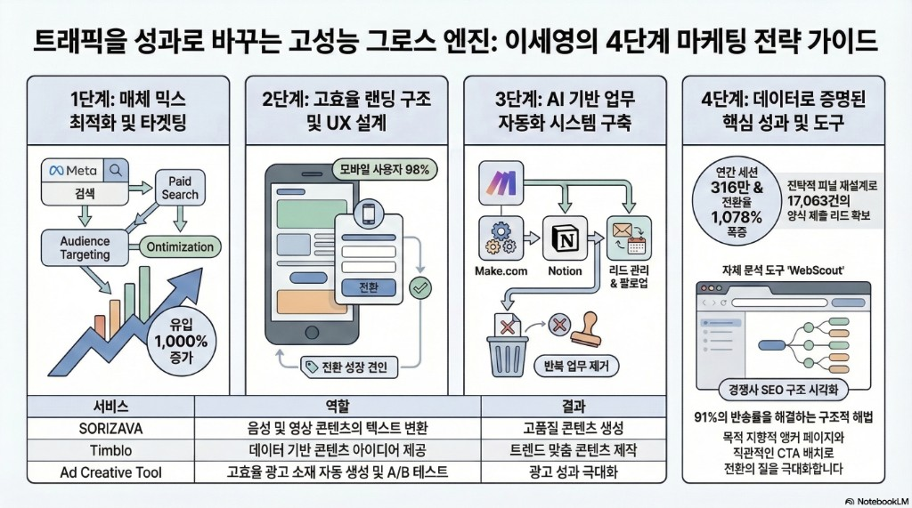
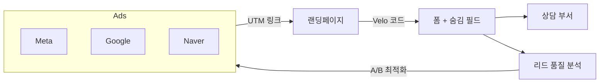
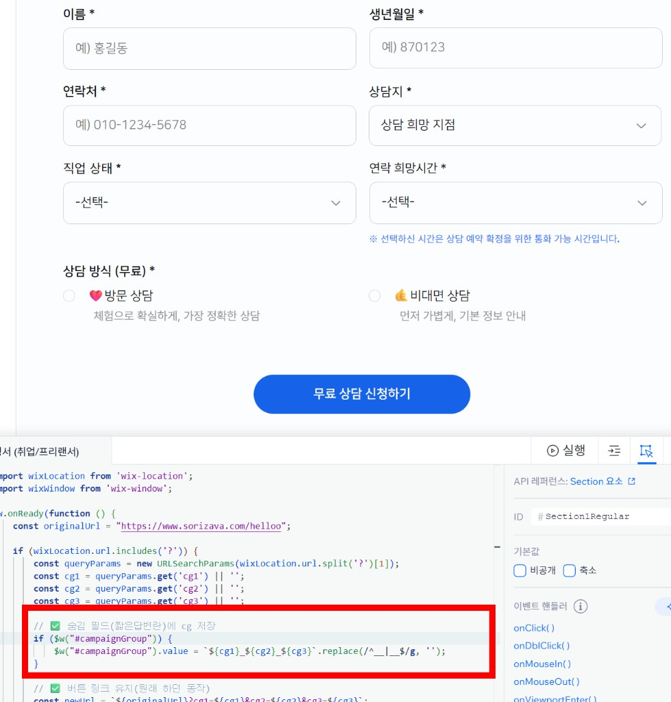
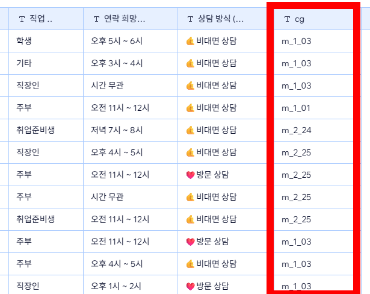
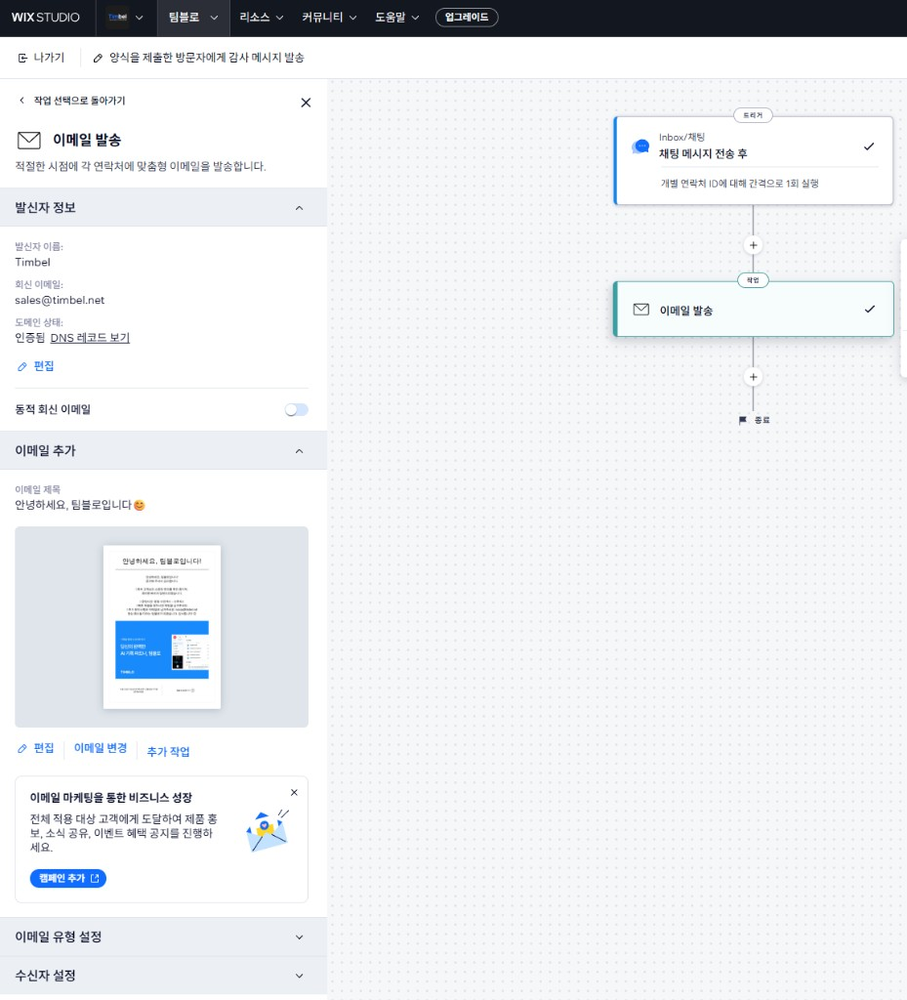

# 이세영 · Seyoung Lee

### I build growth systems, not just campaigns.

Growth Marketing · AI Automation · Web Builder

---

## About Me

안녕하세요. 저는 팀벨(timbel)에서 10년 이상 마케팅을 해오며,  
광고를 운영하는 사람을 넘어 **성장을 만드는 구조 자체를 설계해온 마케터**입니다.

속기 전문 기업이 AI 음성인식 기업으로 전환되는 과정에서,  
제품이 바뀔 때마다 **GTM 전략, 랜딩 구조, 추적 시스템, 리드 자동화, 운영 워크플로우**를 다시 만들었습니다.

저는 단순히 광고를 집행하지 않습니다.  
**광고가 작동하는 구조, 전환이 일어나는 흐름, 팀이 반복적으로 사용할 수 있는 시스템**을 직접 만듭니다.

- **Growth** — Paid media, funnel design, CRO, experimentation
- **Systems** — Attribution tracking, lead ops, AI workflows
- **Build** — Next.js tools, landing pages, internal automation

---

## What I Do

- **Growth Marketing** — 연간 10억+ 규모 광고 운영 (Meta · Google · Naver), 퍼널 설계, A/B 테스트
- **AI Automation** — GPT · Make.com · Notion API 기반 워크플로우 구축
- **Web & Tool Building** — Next.js · Wix Velo로 내부 도구와 사이트 직접 개발
- **Data-driven CRO** — UTM 추적 시스템 설계, 전환 구조 최적화, 소재별 리드 품질 분석
- **Campaign Execution** — 5개 사업부 마케팅 총괄, 멀티채널 캠페인 운영
- **GTM & Product Marketing** — B2B SaaS 런칭, 포지셔닝, 세그먼트별 메시지 설계

---

## Selected Work

### MefiMake — Meta 광고 소재 생성기

콘텐츠 마케터·디자이너를 위한 캔버스 기반 광고 소재 생성기.

**문제** — 디자인 경험 없는 마케터가 광고 소재 제작에 시간을 많이 씀.

**해결** — 잠금 템플릿 위에서 바로 편집할 수 있는 캔버스 도구를 만들었습니다. Safe Zone 가이드, Meta Library 연동, 멀티 포맷 내보내기 포함.

[Live](https://mefimake.vercel.app) · Next.js, Vercel

### WebScout — 경쟁사 사이트 분석 자동화

URL 하나로 경쟁사 사이트를 자동 진단하는 분석 도구.

**문제** — 경쟁사 사이트를 하나하나 수동으로 분석하는 데 시간이 과도하게 소요됨.

**해결** — 크롤러가 사이트 구조를 수집하고, GPT-4o가 UX·SEO·콘텐츠 관점에서 진단 리포트를 자동 생성합니다. 팀원이 URL만 입력하면 리포트를 받을 수 있어, 분석 시간을 대폭 줄였습니다.

[Live Demo](https://webscout-next.vercel.app/) · [GitHub](https://github.com/dalgoms/webscout-next) · Next.js, TypeScript, Vercel

### Ad Creative Tool — 광고 소재 자동화 `진행중`

카피 작성부터 멀티사이즈 내보내기까지 한번에 처리하는 광고 소재 파이프라인.

**문제** — 플랫폼별로 소재를 일일이 만드는 반복 작업.

**해결** — GPT-4o가 타겟·톤에 맞는 카피를 생성하면, 템플릿 엔진이 렌더링하고 여러 사이즈로 자동 내보냅니다. 소재 하나당 걸리던 반복 작업을 파이프라인 하나로 줄였습니다.

[Live](https://ad-creative-tool.vercel.app) · [GitHub](https://github.com/dalgoms/ad-creative-tool) · Next.js, GPT-4o, Supabase

### 리드 자동화 시스템

Wix CMS → Notion → AI 에이전트로 리드 수집부터 팔로업까지 자동화.

**문제** — 리드 데이터 정리, 태깅, 팔로업이 전부 수작업.

**해결** — Wix에서 들어온 리드를 Notion으로 자동 전송하고, AI 에이전트가 데이터 보강·태깅·팔로업을 처리합니다. Notion→GitHub 파이프라인으로 CRM 자동화까지 연결했습니다.

```mermaid
flowchart LR
    A[Wix 폼] -->|Webhook| B[Make.com]
    B --> C[Notion DB]
    C --> D[AI Agent]
    D -->|보강 · 태깅| C
    D --> E[자동 팔로업]
    C -->|Actions| F[CRM]
```

[GitHub](https://github.com/dalgoms/ai_process) · Make.com, Notion API, GitHub Actions

### Telegram Todolist Bot — 텔레그램 → 노션 할일 자동화

텔레그램 메시지로 할일을 남기면 노션 DB에 자동 생성되는 업무 자동화 봇.

**문제** — 회의 중 빠르게 기록한 할일이 정리되지 않고 흩어짐.

**해결** — 텔레그램에 한 줄만 입력하면 노션 DB에 구조화된 할일이 생성됩니다. 한글 접두어로 프로젝트를 분류하고, AI가 복잡한 업무를 하위 태스크로 분해하며, 완료 체인으로 후속 작업까지 자동 연결됩니다.

[GitHub](https://github.com/dalgoms/telegram_todolist_bot) · Python, Telegram Bot API, Notion API, OpenAI

### Telegram File Organizer — AI 파일 자동 정리 봇

텔레그램에서 폴더 경로를 보내면 AI가 분석하여 자동으로 정리해주는 봇.

**문제** — 수년간 쌓인 파일이 뒤섞여 있고, 중복 파일과 "최종_수정_진짜최종" 버전 지옥.

**해결** — 텔레그램에 폴더 경로 한 줄만 보내면 AI가 파일을 분류하고, 중복을 탐지하고, "최종_진짜최종" 같은 버전 체인을 정리합니다. 오래된 파일은 연도별 아카이브로 제안하고, 집·회사 PC 어디서든 같은 방식으로 작동합니다.

[GitHub](https://github.com/dalgoms/telegram-file-organizer) · Python, Telegram Bot API, OpenAI, Google Drive API

---

## Growth & Performance

- Meta · Google · Naver 광고를 10년간 직접 운영하며, 채널별 퍼널을 반복 실험하고 최적화했습니다.
- SK hynix · SK Telecom 공동 AI SaaS 런칭, 첫해 매출 목표를 초과 달성했습니다.
- STT · 미디어자막 · 영상편집 · 번역 등 5개 사업부 마케팅을 총괄했습니다.
- 디자이너·영상PD·콘텐츠 마케터로 구성된 홍보마케팅 팀을 2명 유닛에서 10명+ 독립 부서로 성장시켰습니다.

### SORIZAVA — AI 속기 서비스

> 핵심 매출 서비스 · 풀퍼널 마케팅 · 자체 어트리뷰션 추적

**문제** — 10년 이상 운영된 속기 서비스라 유입 경로 추적이 없었고, 어떤 채널에서 온 리드가 전환되는지 알 수 없는 구조였습니다.

**해결** — UTM 코드를 직접 설계해서, 채널·소재·키워드별 유입을 양식에 자동 기록하는 추적 시스템을 구축했습니다. Wix 폼 + 숨김 필드 + Velo 코드를 조합해서 상담 부서가 고객의 유입 맥락을 사전에 파악할 수 있게 만들었습니다.

```mermaid
flowchart LR
    subgraph Ads
        A[Meta]
        B[Google]
        C[Naver]
    end
    Ads -->|UTM 링크| D[랜딩페이지]
    D -->|Velo 코드| E[폼 + 숨김 필드]
    E --> F[상담 부서]
    E --> G[리드 품질 분석]
    G -->|A/B 최적화| Ads
```

**결과** — 매출 YoY **38%** 성장, ROAS **650%**, 트래픽 2배 증가 대비 전환 **1,078%** 증가. 소재별 리드 품질 분석과 A/B 테스트로 퍼널을 지속 개선하고 있습니다.

UTM 추적 시스템 상세

 

[sorizava.com](https://www.sorizava.com/) · [성과 리포트](reports/2025-website-performance.md) · [CRO 전략](reports/2025-cro-strategy.md)

### Timblo — AI 회의록 SaaS

> B2B SaaS · 250+ 기업 고객 · SK hynix & SK Telecom 공동 런칭

**문제** — B2B/B2C 채널 분산, 앱·웹·스토어 간 메시지 불일치.

**해결** — 제품 포지셔닝부터 세그먼트별 메시지 분리, B2B 온보딩, 영업 자료까지 GTM 전반을 직접 설계하고 실행했습니다.

**결과** — SK hynix · SK Telecom 공동 런칭 첫해 매출 목표 초과 달성, **250+** 기업 고객 확보.

[timblo.io](https://timblo.io/ko) · [Google Play](https://play.google.com/store/apps/details?id=net.timblo.mobile.aos)

### 웹사이트 운영

8개 사이트를 동시에 기획·운영하면서, 서비스별 리드 파이프라인을 자동화했습니다. 고객이 문의하면 세그먼트별 소개서가 자동 발송되고, 각 부서로 리드가 분배됩니다.

운영 사이트 목록

 

| 분류 | 사이트 | 설명 |
|---|---|---|
| 기업 | [timbel.net](https://www.timbel.net/) | AI 음성 플랫폼 · B2B 서비스 허브 |
| 서비스 | [sorizava.com](https://www.sorizava.com/) | 속기 서비스 · AI 속기사 |
| 서비스 | [clipdesk.net](https://www.clipdesk.net/) | 영상 편집 서비스 |
| 콘텐츠 | [textarbiz.com](https://www.textarbiz.com/) | 자막/번역 서비스 |
| 글로벌 | [textarglobal.com](https://www.textarglobal.com/) | 글로벌 자막 서비스 |
| 플랫폼 | [worksfy.net](https://www.worksfy.net/) | 속기사 매칭 플랫폼 |
| SaaS | [timblo.io](https://timblo.io/ko) | AI 회의록 SaaS |
| App | [Timblo App](https://play.google.com/store/apps/details?id=net.timblo.mobile.aos) | AI 회의 녹음·요약 앱 |

리드 자동화 상세

 

---

## Reports

| 문서 | 내용 |
|---|---|
| [성과 리포트 (2025)](reports/2025-website-performance.md) | 채널별 성과, 전환 퍼널, 핵심 인사이트 |
| [CRO 전략 (2025)](reports/2025-cro-strategy.md) | 데이터 기반 UX 및 전환율 최적화 |

---

## Tech Stack

**Dev**

**AI · Automation**

**Ads · Analytics**

**Design · Messaging**

---

## Contact

**AI SaaS · Growth Marketing · B2B · 마케팅 자동화** 관련 기회에 열려 있습니다.

 

---

## English

> Full English version → [README_EN.md](README_EN.md)

### Seyoung Lee

Growth marketer who builds. 10+ years leading marketing at timbel, through the company's pivot from stenography to AI speech recognition. Every time the product changed, I rebuilt the marketing stack from scratch — sites, tracking, automation, campaigns, all of it.

I don't just run ads. I build the infrastructure around them — custom attribution tracking, AI-powered lead workflows, and internal tools my team uses daily.

**Impact** — **14x** lead growth · **650%** ROAS · **1,078%** conversion increase · **250+** enterprise clients. 10+ years managing $1M+ annual ad budget across Meta, Google, Naver. Co-launched AI SaaS with SK hynix & SK Telecom — exceeded first-year revenue target.

**Things I Built**

- [**MefiMake**](https://mefimake.vercel.app) — Canvas-based Meta ad creative generator
- [**WebScout**](https://webscout-next.vercel.app/) — Competitive site crawler + GPT-4o diagnostics · [GitHub](https://github.com/dalgoms/webscout-next)
- [**Ad Creative Tool**](https://ad-creative-tool.vercel.app) — AI copy → template → multi-size export · [GitHub](https://github.com/dalgoms/ad-creative-tool)
- **Lead Automation** — Wix → Notion → AI agent pipeline · [GitHub](https://github.com/dalgoms/ai_process)
- [**Telegram Todolist Bot**](https://github.com/dalgoms/telegram_todolist_bot) — Telegram → Notion task automation with AI decomposition & workflow templates
- [**Telegram File Organizer**](https://github.com/dalgoms/telegram-file-organizer) — AI-powered file organization with duplicate detection, version chain analysis & multi-device support

**Stack**

 
