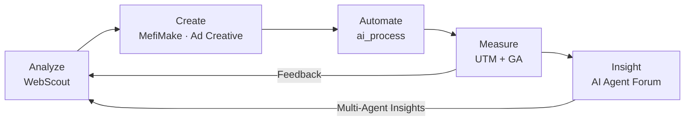
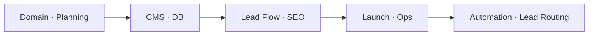

# Seyoung Lee
### Growth Marketer · AI Products · Web & Automation Builder

[한국어](README.md) | **English**

**timbel** · Head of Marketing & PR · 10+ years

I joined timbel when it was a professional shorthand company and have been there through its full pivot to AI-powered speech recognition. Over that decade, every time the product changed, I rebuilt the marketing around it — new websites, new lead systems, new campaigns. When generative AI showed up in 2022, I started using it right away for ad creatives, landing pages, and campaign copy, which made a real difference in how fast we could test and iterate. Today I build and use my own AI tools in production every day.

> **14x** lead growth · **650%** ROAS · **1,078%** conversion increase · **₩7.2B** revenue · **250+** enterprise clients · **8** websites in production

---

## Key Results

* Ran **₩800M–1.5B annual ad budgets** (~$600K–$1.1M) across Meta, Google, and Naver for 10+ years
* Revenue **₩5.2B → ₩7.2B**, **650% ROAS**
* Conversion up **1,078%** (17,063 form submissions) while traffic only doubled
* Designed custom attribution tracking (UTM + hidden fields + Wix Velo) → analyzed lead quality by creative and interest → improved funnel through continuous A/B testing
* Co-launched AI SaaS with SK hynix & SK Telecom — **₩1.1B** in service revenue
* Owned marketing across 5+ product lines (STT, media captioning, video editing, translation)
* Grew marketing from a small unit into a standalone department of 10+

> [Performance Report (2025)](reports/2025-website-performance-en.md) — Channel breakdown, conversion funnel, key insights
>
> [CRO Strategy (2025)](reports/2025-cro-strategy-en.md) — Data-driven UX and conversion optimization

---

## Things I Built

Every tool here was born from a real bottleneck I found on the team. I built each one, deployed it to teammates, and it actually cut our research and production time significantly.

### MefiMake — Meta Ad Creative Generator

Built for content marketers and designers who live in Figma. Marketers who aren't designers can use locked-down templates to produce ad creatives fast. Includes Safe Zone guides, Meta Library integration, and a canvas-based editor.

[Live](https://mefimake.vercel.app) · Next.js, Vercel

### WebScout — Competitive Site Analysis

Analyzing competitor sites was eating up too much time, so I built a tool for it. Enter a URL, it crawls the structure, and GPT-4o generates a diagnostic report.

[Live Demo](https://webscout-next.vercel.app/) · [GitHub](https://github.com/dalgoms/webscout-next) · Next.js, TypeScript, Vercel

### Ad Creative Tool — Ad Production Automation `In Progress`

Got tired of making the same ad in five different sizes for every platform. This tool generates AI copy, renders it on templates, and exports all sizes at once.

[Live](https://ad-creative-tool.vercel.app) · [GitHub](https://github.com/dalgoms/ad-creative-tool) · Next.js, GPT-4o, Supabase

### Lead Automation System

Leads come in through Wix CMS, get piped into Notion, and AI agents handle the repetitive stuff — enrichment, tagging, follow-up. The team focuses on analysis and closing.

Make.com, Notion API, GitHub Actions

---

## Service Marketing

### SORIZAVA

> Core revenue service · AI stenographer awareness · Full-funnel marketing

| Problem | Solution |
|---|---|
| Leads and conversion stalling due to legacy service structure | Built UTM-based A/B testing, redesigned the conversion flow |

I set up UTM tracking from scratch — designed the codes so every form submission automatically records which channel, creative, and keyword drove it. Combined Wix forms, hidden fields, and Velo code into an end-to-end system that gives the sales team full context on each lead before the first call.

UTM Tracking Details

 

[sorizava.com](https://www.sorizava.com/) · [Performance Report](reports/2025-website-performance-en.md) · [CRO Strategy](reports/2025-cro-strategy-en.md)

---

### Timblo — AI Meeting Notes SaaS

> B2B SaaS · 250+ enterprise clients · Joint launch with SK hynix & SK Telecom

| Problem | Solution |
|---|---|
| Scattered B2B/B2C channels, inconsistent messaging across app/web/store | Built a unified communication structure with channel-specific conversion flows |

Handled the full GTM: product positioning, segment-level messaging (SMB / mid-market / enterprise), B2B onboarding, and sales materials.

[timblo.io](https://timblo.io/ko) · [Google Play](https://play.google.com/store/apps/details?id=net.timblo.mobile.aos)

---

## How I Work

For ad spend to turn into real leads, the whole chain — media, landing, conversion — has to line up. I built mobile-first landing pages for a 98% mobile audience and designed anchor pages that cut a 91% bounce rate. Result: 10x conversion growth on only 2x traffic.

---

## Growth Marketing OS

Every tool was built to solve a real bottleneck on the team. They connect into one system: analyze → create → automate → measure → insight.

| Phase | Tool | What it does | Status |
|---|---|---|---|
| **Analyze** | [WebScout](https://webscout-next.vercel.app/) | Site crawling · AI diagnostic reports | LIVE |
| **Create** | [MefiMake](https://mefimake.vercel.app) | Meta ad creative generator · canvas-based template editor | LIVE |
| **Create** | [Ad Creative Tool](https://ad-creative-tool.vercel.app) | AI copy · multi-size export | In Progress |
| **Automate** | [ai_process](https://github.com/dalgoms/ai_process) | Notion→GitHub pipeline · CRM automation | LIVE |
| **Measure** | UTM + GA + Wix | Channel tracking · funnel analysis | LIVE |
| **Insight** | AI Agent Forum | Multi-agent debate for market, competitive & sales insights | LIVE |

> Built all six myself. They're all in active use.

---

## Websites

I plan and run 8 sites at the same time, each with its own automated lead pipeline. When someone inquires, they get a segment-matched brochure automatically, and the lead routes to the right team.

Lead Automation Details

 

| Type | Site | Description | My role |
|---|---|---|---|
| Corporate | [timbel.net](https://www.timbel.net/) | AI voice platform · B2B hub | Web planning · lead structure · CMS |
| Service | [sorizava.com](https://www.sorizava.com/) | Stenography · AI stenographer | SEO · conversion · optimization |
| Service | [clipdesk.net](https://www.clipdesk.net/) | Video editing service | Launch · service planning |
| Content | [textarbiz.com](https://www.textarbiz.com/) | Subtitle/translation service | Communication · structure |
| Global | [textarglobal.com](https://www.textarglobal.com/) | Global subtitle service | Global communication |
| Platform | [worksfy.net](https://www.worksfy.net/) | Stenographer matching | Ops structure |
| SaaS | [timblo.io](https://timblo.io/ko) | AI meeting notes · 250+ clients | Product comms · B2B design |
| App | [Timblo App](https://play.google.com/store/apps/details?id=net.timblo.mobile.aos) | AI meeting recording app | App communication |

---

## Tech & Tools

| Category | Stack | What I use it for |
|---|---|---|
| Website Ops | Wix · SEO · GA4 | Domain · CMS · DB · forms · lead flow |
| AI / Automation | GPT · Claude · Cursor · Make.com · Notion API | Copy · workflows · lead automation |
| Dev | Next.js · TypeScript · Node.js · Vercel | AI tools · analytics systems |
| Design | Figma · PS · AI · Premiere | Mockups · creative production |
| Analysis | UTM · A/B Testing · Funnel Analysis | Measurement · conversion optimization |
| Messaging | Telegram Bot · Slack · Gmail · KakaoTalk | Alerts · follow-up |

---

## Contact

Open to roles in **AI SaaS · Growth Marketing · B2B · Marketing Automation**.

**Email** seyoung8967@gmail.com · **LinkedIn** [linkedin.com/in/seyounglees](https://www.linkedin.com/in/seyounglees/)
