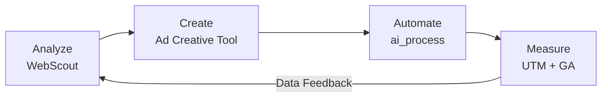

# Seyoung Lee
### Growth Marketing Lead · Strategy, Web & Automation

**Timbel** · Head of Marketing & PR · 10+ Years

[한국어](README.md) | **English**

## Core Results
* Managed **annual ad budgets of ₩800M–1.5B** (~$600K–$1.1M) with continuous media mix optimization for 10+ years
* Achieved 3.16M annual sessions (+104% YoY) and 1,078% conversion surge (17,063 form submissions)
* Drove ~1,000% increase in Meta (FB/IG) paid search acquisition and optimized channel mix
* Reached 94% new visitor ratio with focused targeting on key metropolitan personas
* Led 10+ member cross-functional marketing team — designers, marketers, front-end engineers, video production — with full cross-departmental collaboration
* Scaled team to independent department as business opportunities grew, managing end-to-end from new service launches to full-funnel marketing

> [Full Performance Report (2025)](reports/2025-website-performance-en.md) — Channel performance, conversion funnel, key insights
>
> [CRO Strategy (2025)](reports/2025-cro-strategy-en.md) — Data-driven UX and conversion rate optimization strategy

---

## Featured Work

### SORIZAVA

> Core revenue service · AI Stenographer awareness · Full-funnel marketing

| Problem | Solution |
|---|---|
| Stagnant leads and conversion efficiency due to legacy service structure | Built UTM-based A/B testing system, restructured conversion bottlenecks to redesign lead expansion |

Designed UTM codes directly during ad setup to automatically capture which channel, creative, and keyword drove each form submission. Built an end-to-end tracking system combining Wix forms, hidden fields, and Velo code, enabling the consultation team to know each prospect's interests and acquisition context before the first contact.

UTM Tracking System Details

 

[sorizava.com](https://www.sorizava.com/) · [Performance Report](reports/2025-website-performance-en.md) · [CRO Strategy](reports/2025-cro-strategy-en.md)

---

### Timblo

> AI Meeting Minutes SaaS · Joint service launch with SK hynix & SK telecom · Marketing collaboration

| Problem | Solution |
|---|---|
| Fragmented B2B/B2C channels with inconsistent messaging across app, web, and store | Designed unified communication structure and channel-specific conversion flows across web, app, and store |

[timblo.io](https://timblo.io/ko) · [Google Play](https://play.google.com/store/apps/details?id=net.timblo.mobile.aos)

---

### WebScout

> Self-built analysis tool · Next.js · Vercel · GPT-4o

| Problem | Solution |
|---|---|
| Excessive time spent analyzing competitor site structures and SEO opportunities | Auto-crawling + GPT-4o AI diagnostic reports automate everything from structure analysis to growth opportunity identification |

[Live Demo](https://webscout-next-8veo.vercel.app/) · [GitHub](https://github.com/dalgoms/webscout-next)

---

### Ad Creative Tool

> Ad creative automation system · Next.js · GPT-4o · Supabase

| Problem | Solution |
|---|---|
| Manual, repetitive production of ad creatives per platform | Built integrated system combining AI copy generation, template rendering, and multi-size automation |

[Live](https://ad-creative-tool.vercel.app) · [GitHub](https://github.com/dalgoms/ad-creative-tool)

---

## What I Do

**Turning media budgets into compounding business assets through optimized UX.**

Aligning the entire journey — media, landing, conversion — so that every dollar spent becomes a real business lead. Built mobile-only landing pages for a 98% mobile audience and designed anchor pages to address 91% bounce rates, achieving 10x conversion growth against 2x traffic growth.

---

## Growth Marketing OS

From analysis to creative, execution to measurement — self-built tools connected as a unified marketing operations system.

| Phase | Tool | Role | Status |
|---|---|---|---|
| **Analyze** | [WebScout](https://webscout-next-8veo.vercel.app/) | Site structure crawling · IA/SEO visualization · AI diagnostic reports | LIVE |
| **Create** | [Ad Creative Tool](https://ad-creative-tool.vercel.app) | AI copy generation · multi-size automation | LIVE |
| **Automate** | [ai_process](https://github.com/dalgoms/ai_process) | Notion→GitHub→Deploy pipeline · CRM automation | LIVE |
| **Measure** | UTM + GA + Wix | Channel-level conversion tracking · funnel analysis | LIVE |

> All 4 phases were personally designed and developed, and are actively used in production.

---

## Websites & Service Operations

Simultaneously planned and operated 8 web properties, building automated lead pipelines for each service.

Designed automation to send segment-specific service brochures upon inquiry, deployed to department heads for autonomous operation. Enterprise leads are monitored centrally via master email while each department handles responses through individually assigned inboxes.

Lead Automation Details

 

| Category | Site | Description | Role |
|---|---|---|---|
| Corporate | [timbel.net](https://www.timbel.net/) | AI Voice Platform · B2B Service Hub | Web planning · messaging · lead structure · CMS ops |
| Service | [sorizava.com](https://www.sorizava.com/) | Stenography keyboard · AI Stenographer | SEO · conversion structure · ops optimization |
| Service | [clipdesk.net](https://www.clipdesk.net/) | Video editing service · Creators/Enterprise | Launch support · service planning · communication |
| Content | [textarbiz.com](https://www.textarbiz.com/) | Subtitle/Translation service · Global division | Service communication · structure |
| Global | [textarglobal.com](https://www.textarglobal.com/) | Global subtitle service · AI+Human workflow | Global communication · ops support |
| Platform | [worksfy.net](https://www.worksfy.net/) | Stenographer matching platform | Ops structure · service flow support |
| SaaS | [timblo.io](https://timblo.io/ko) | AI Meeting Minutes SaaS · 250+ enterprise clients | Product communication · B2B structure |
| App | [Timblo App](https://play.google.com/store/apps/details?id=net.timblo.mobile.aos) | AI meeting recording & summary app | App communication · service ops support |

---

## Tech & Tools

| Category | Technologies | Role |
|---|---|---|
| Website Ops | Wix · SEO · GA | Domain · CMS · DB · forms · lead flow ops |
| AI / Automation | GPT · Claude · Make.com · Notion API | Copy generation · workflow · lead automation |
| Dev | Next.js · TypeScript · Vercel | Internal tools · analytics systems |
| Design | Figma · PS · AI · Premiere | Planning visualization · creative production |
| Analysis | UTM · A/B · Funnel Analysis | Performance measurement · conversion optimization |
| Messaging | Telegram Bot · Gmail · KakaoTalk | Automated alerts · follow-up |

---

## Contact

Open to opportunities in Growth Marketing, Website Ops, CRM, and AI Automation.

**Email** seyoung8967@gmail.com · **LinkedIn** [linkedin.com/in/seyounglees](https://www.linkedin.com/in/seyounglees/)
