# CRO Strategy 2025

**Data-Driven Website UX & Conversion Rate Optimization Strategy**

> sorizava.com · From quantitative expansion to qualitative optimization

---

## Situation at a Glance

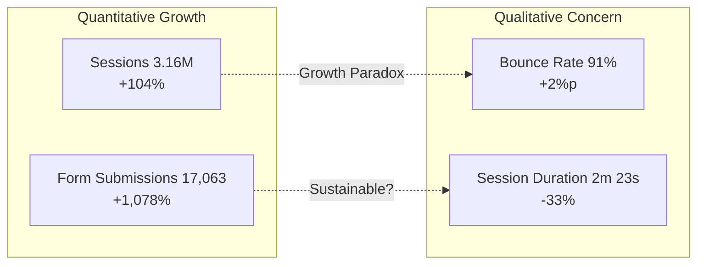

| Metric | Value | YoY | Signal |
|---|---:|---|:---:|
| Sessions | 3.16M | +104% | + |
| Unique Visitors | 2.22M | +92% | + |
| Form Submissions | 17,063 | +1,078% | + |
| Bounce Rate | 91.0% | +2%p | - |
| Avg Session Duration | 2m 23s | -33% | - |
| Pages per Session | 1.1 | — | - |

**Core Diagnosis:** The quantitative explosion of 2025 was a media optimization victory. The next challenge is clear — **qualitative refinement of the conversion structure** to capture the 91% of prospects currently bouncing.

---

## 1. User Behavior Data Deep Dive

### Traffic Inflow vs Conversion Efficiency

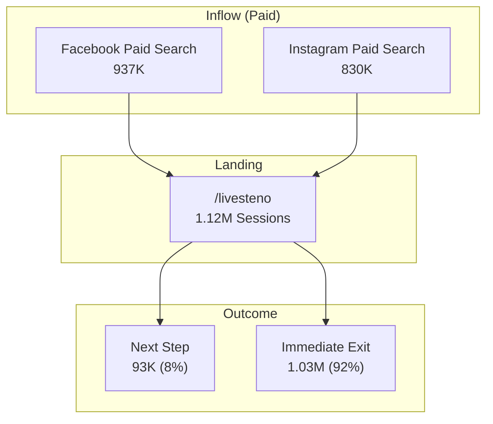

| Segment | Volume | Interpretation |
|---|---:|---|
| Paid Ads → Landing | 1.77M | Meta media optimization success |
| Landing → Engaged | ~93K (8%) | Site experience delivery failure |
| Landing → Bounced | ~1.03M (92%) | Marketing ROI leakage |
| Engaged → Converted | 17,063 | Conversion structure itself works |

> +1,078% conversions are a success of media-landing alignment. The next leverage is **capturing additional conversion opportunities** from the 91% bounce segment.

---

## 2. Device Environment Analysis

### Extreme Mobile Dominance

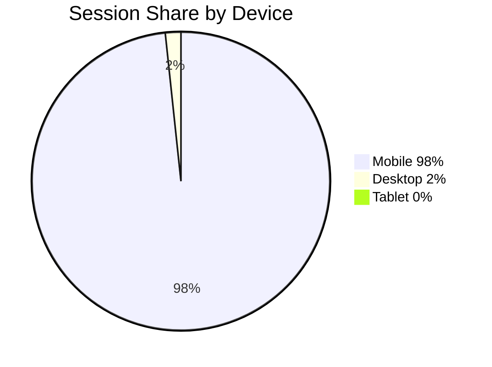

| Device | Sessions | Share |
|---|---:|---:|
| Mobile | 3.10M | **98%** |
| Desktop | 53K | 2% |
| Tablet | 15K | 0% |

### Strategic Assessment

> Building mobile-only landing pages for the 98% mobile environment was the foundation of 10x conversion growth. The next step is redefining the entire remaining UI to a **mobile-only** standard.

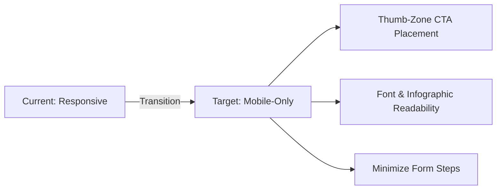

---

## 3. User Navigation Bottleneck Analysis

### The Main Leak: /livesteno

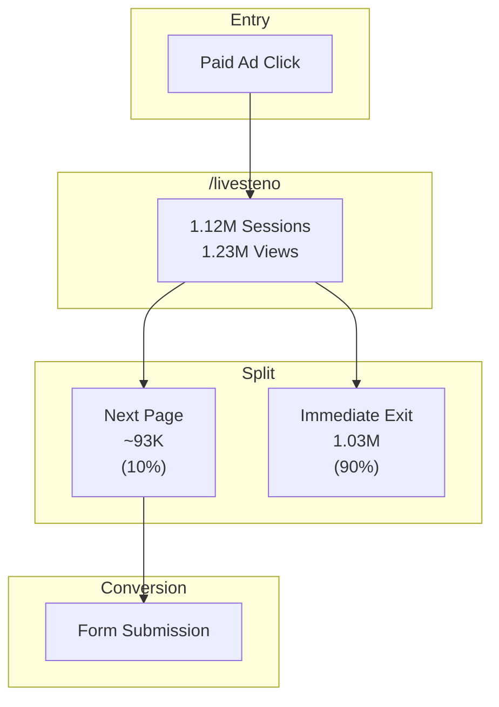

### Bottleneck Diagnosis

| Problem | Data | Meaning |
|---|---|---|
| Single page consumption | 1.1 pages/session | Users leave after viewing one page |
| No narrative | No next-step suggestion | Failed to sustain engagement |
| Information island | /livesteno isolated | 1.23M views not connecting to conversions |

> /livesteno successfully concentrated 1.12M sessions as an anchor page. The key to next-stage growth is **stitching** this traffic to the next step.

---

## 4. Site Narrative Redesign

### Current vs Target UX Flow

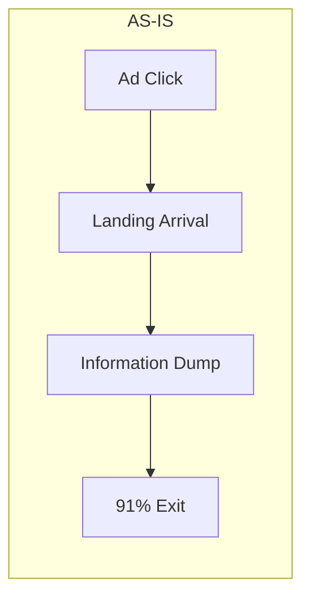

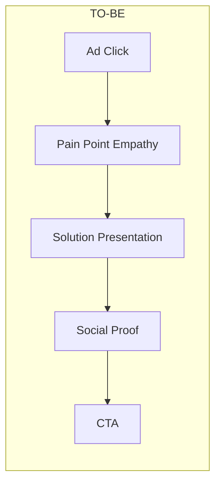

### Narrative Redesign Framework

| Stage | Current | Improvement | Expected Effect |
|---|---|---|---|
| 1. Entry | Information dump | Pain Point empathy headline | Scroll engagement |
| 2. Exploration | No next step | Solution + Social Proof sequence | Increased dwell time |
| 3. Conversion | Unclear CTA position | Fixed CTA within Thumb-Zone | Higher conversion rate |
| 4. Connection | Pages disconnected | /livesteno → /hello bridge design | More pages per session |

### Session Duration Recovery Strategy

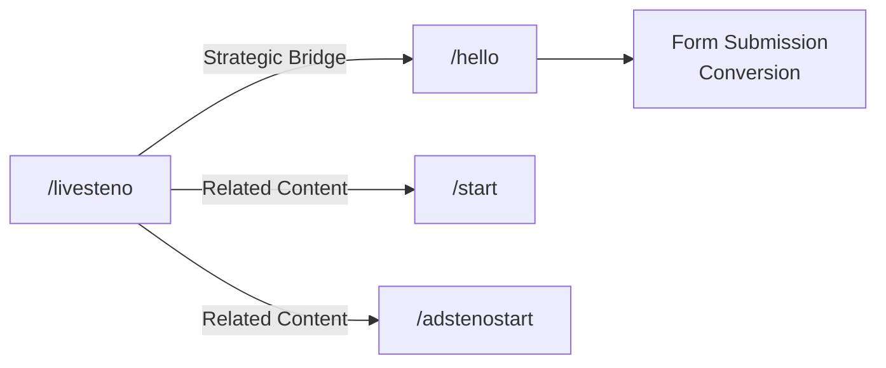

---

## 5. Conversion Maximization: CTA Optimization

### Proven Success Formula

| CTA | Location | Clicks | Conversion Power |
|---|---|---:|---|
| Apply Now | /hello | **9,100** | Strongest |
| Purchase | /sorizavakeyboard | **5,417** | High |
| Purchase | /sorizavakeyboard | **5,106** | High |
| Apply Now | /helloo | **3,911** | Medium-High |
| Purchase | /sorizavakeyboard | **3,915** | Medium-High |

### CTA Transplant Strategy

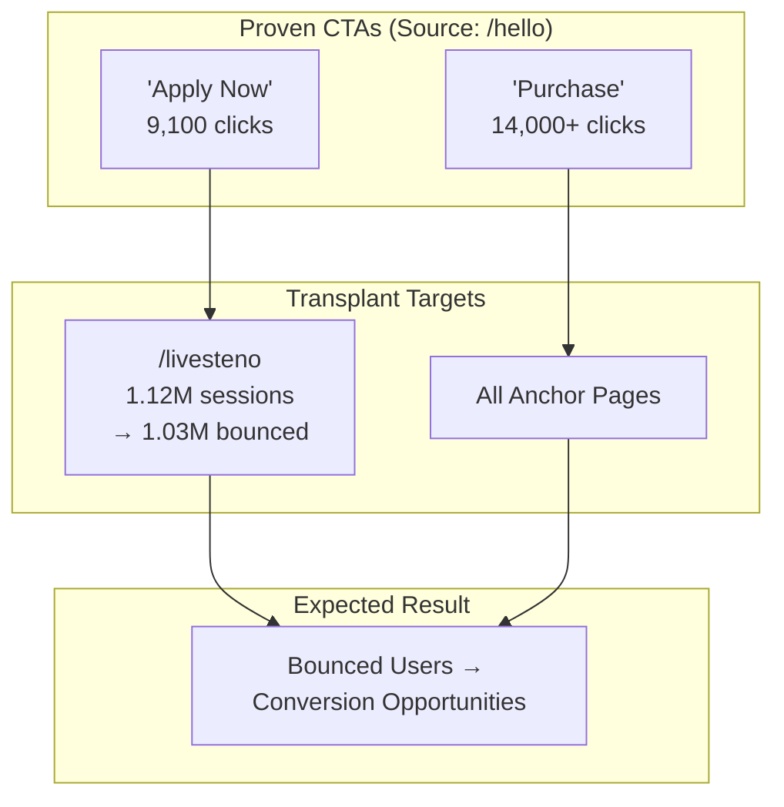

### Frictionless Form Design Principles

| Principle | Execution |
|---|---|
| Minimize input steps | Expose only required fields, leverage autofill |
| Show progress | Step indicators to give completion sense |
| Mobile keyboard optimization | Appropriate keyboard type per input field |
| Prevent mid-form abandonment | Auto-save form data on exit |

---

## 6. Execution Roadmap

### 3 Core Initiatives

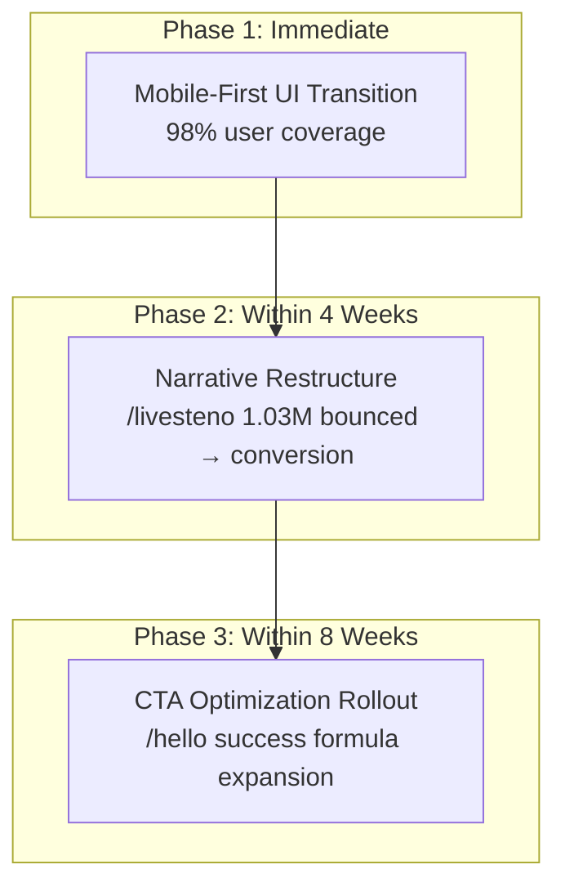

### Initiative Details

| Initiative | Key Action | Target Metric | Expected Impact |
|---|---|---|---|
| Mobile First | Deprecate desktop UI, Thumb-Zone CTA | Bounce rate 91% → below 80% | Mobile conversion rate increase |
| Narrative Restructure | /livesteno → /hello bridge, storytelling flow | Pages/session 1.1 → 2.0+ | Session duration recovery |
| CTA Rollout | 'Apply Now' button site-wide, Frictionless forms | +30% additional form submission growth | ROI maximization |

### Projected Impact on Success

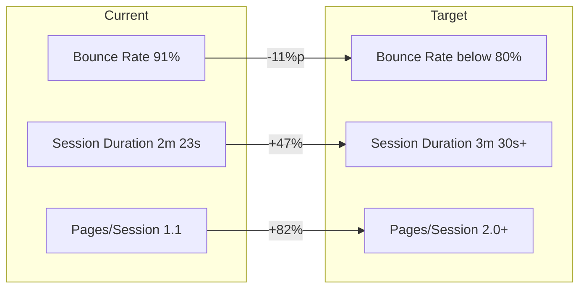

---

## Conclusion

The direction the data points to is clear.

**The era of quantitative expansion is over. It's time for qualitative optimization.**

3.16M sessions and 17,063 conversions were the victory of media optimization and anchor page strategy. Building on this success, transplanting the proven CTA strategy from /hello to /livesteno, transitioning to mobile-only UX, and connecting inter-page narratives — these three are the next leverage points to structurally scale current performance.

---

*Growth Marketing Lead · Seyoung Lee · [Performance Report](2025-website-performance-en.md) · [Back to README](../README_EN.md)*
