# CRO Strategy 2025

**데이터 기반 웹사이트 UX 및 전환율 최적화(CRO) 전략**

> sorizava.com · 양적 팽창을 넘어 질적 최적화로의 전환

---

## Situation at a Glance

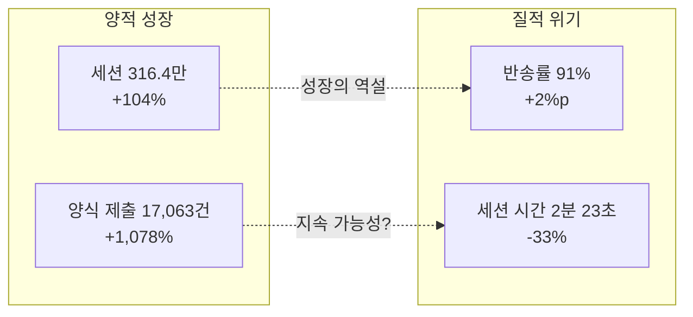

| 지표 | 수치 | YoY | 신호 |
|---|---:|---|:---:|
| 세션 수 | 316.4만 | +104% | + |
| 고유 방문자 | 222.3만 | +92% | + |
| 양식 제출 | 17,063건 | +1,078% | + |
| 반송률 | 91.0% | +2%p | - |
| 평균 세션 시간 | 2분 23초 | -33% | - |
| 세션당 페이지 수 | 1.1 | — | - |

**핵심 진단:** 유료 광고로 끌어들인 잠재 고객의 91%가 사이트 가치를 경험하기도 전에 이탈. 양적 성장의 이면에 숨겨진 **'밑 빠진 독에 물 붓기'** 구조.

---

## 1. 사용자 행동 데이터 심층 진단

### 트래픽 유입 vs 전환 효율

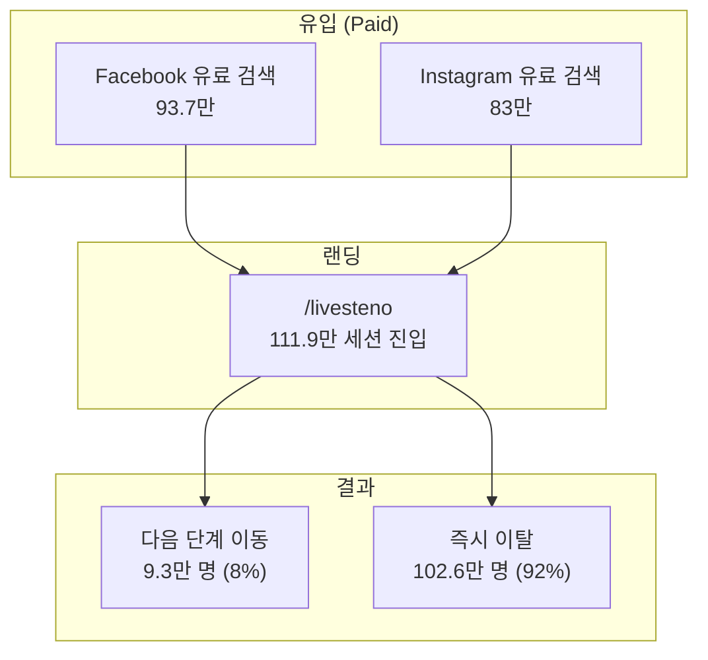

| 구간 | 수치 | 해석 |
|---|---:|---|
| 유료 광고 → 랜딩 | 176.7만 | Meta 매체 최적화 성공 |
| 랜딩 → 체류 | ~9.3만 (8%) | 사이트 경험 전달 실패 |
| 랜딩 → 이탈 | ~102.6만 (92%) | 마케팅 ROI 누수 |
| 체류 → 전환 | 17,063건 | 전환 구조 자체는 작동 |

> 전환 +1,078%는 고무적이나, 91% 반송률은 현재 마케팅 ROI가 극히 비효율적임을 증명하는 **경고등**이다.

---

## 2. 디바이스 환경 분석

### 극단적 모바일 편중

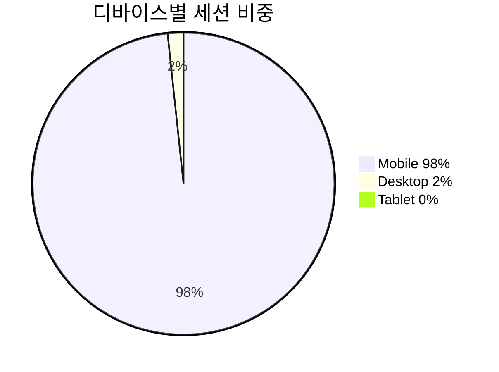

| 디바이스 | 세션 | 비중 |
|---|---:|---:|
| Mobile | 309.5만 | **98%** |
| Desktop | 5.3만 | 2% |
| Tablet | 1.5만 | 0% |

### 전략적 판단

> 데스크톱 기반 사고방식의 완전한 폐기.
> 2%의 예외적 환경을 고려하기 위해 98%의 주력 사용자에게 불편한 경험을 강요하는 현 체제는 비즈니스적 실책.

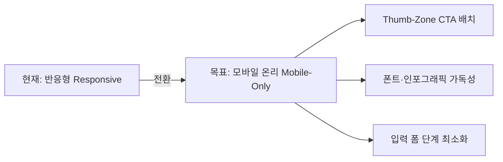

---

## 3. 사용자 탐색 경로 병목 분석

### The Main Leak: /livesteno

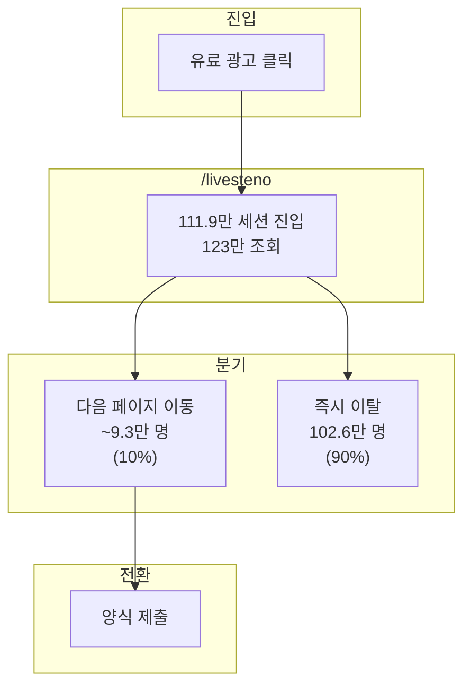

### 병목 진단 요약

| 문제 | 데이터 | 의미 |
|---|---|---|
| 단일 페이지 소비 | 세션당 1.1페이지 | 사용자가 한 페이지만 보고 떠남 |
| 내러티브 부재 | 다음 단계 제안 없음 | 지속적 흥미 유발 실패 |
| 정보의 섬 | /livesteno 고립 | 123만 뷰의 트래픽이 전환으로 연결되지 않음 |

> 111.9만 세션이 진입하는 /livesteno는 사이트의 가장 거대한 입구이자, 102.6만 명이 빠져나가는 가장 거대한 출구다.

---

## 4. 사이트 내러티브 재설계

### 현재 vs 목표 UX 흐름

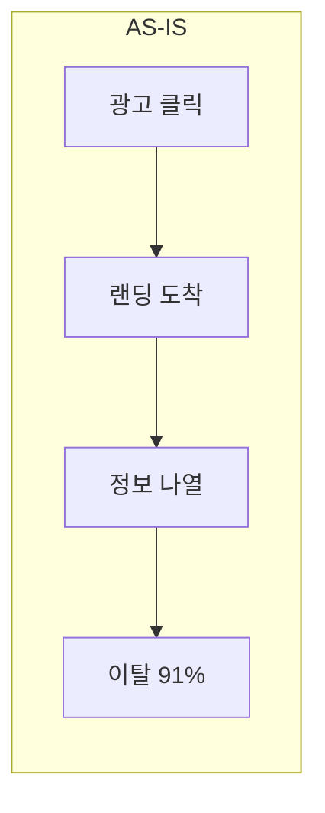

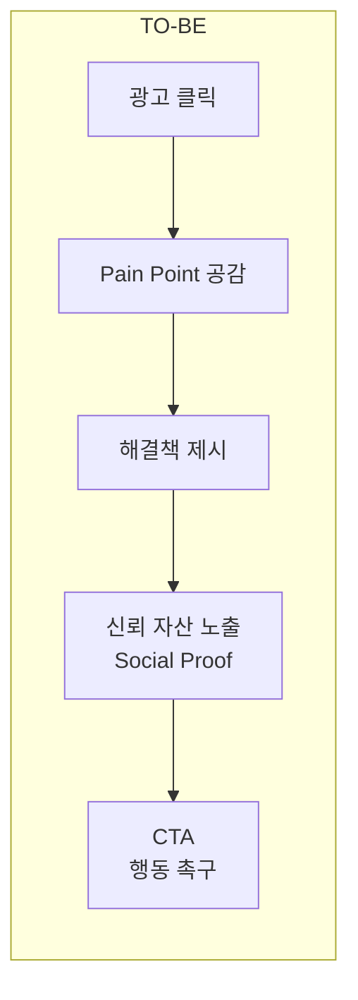

### 내러티브 재설계 프레임워크

| 단계 | 현재 | 개선안 | 기대 효과 |
|---|---|---|---|
| 1. 진입 | 정보 나열형 | Pain Point 공감형 헤드카피 | 스크롤 유도 |
| 2. 탐색 | 다음 단계 없음 | 해결책 + Social Proof 순차 배치 | 체류 시간 증가 |
| 3. 전환 | CTA 위치 불명확 | Thumb-Zone 내 고정 CTA | 전환율 상승 |
| 4. 연결 | 페이지 간 단절 | /livesteno → /hello 가교 설계 | 세션당 페이지 수 증가 |

### 체류 시간 반전 전략

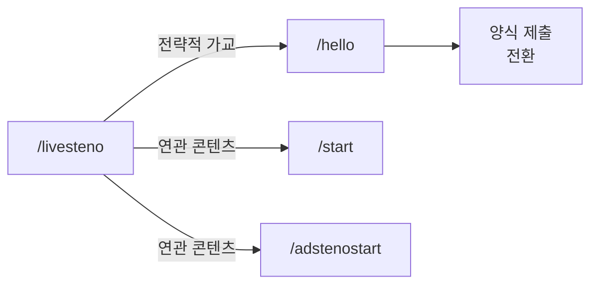

---

## 5. 전환 극대화: CTA 최적화

### 검증된 성공 공식

| CTA | 위치 | 클릭 수 | 전환력 |
|---|---|---:|---|
| 지금 바로 신청하기 | /hello | **9,100건** | 최강 |
| 구입하기 | /sorizavakeyboard | **5,417건** | 상 |
| 구입하기 | /sorizavakeyboard | **5,106건** | 상 |
| 지금 바로 신청하기 | /helloo | **3,911건** | 중상 |
| 구입하기 | /sorizavakeyboard | **3,915건** | 중상 |

### CTA 이식 전략

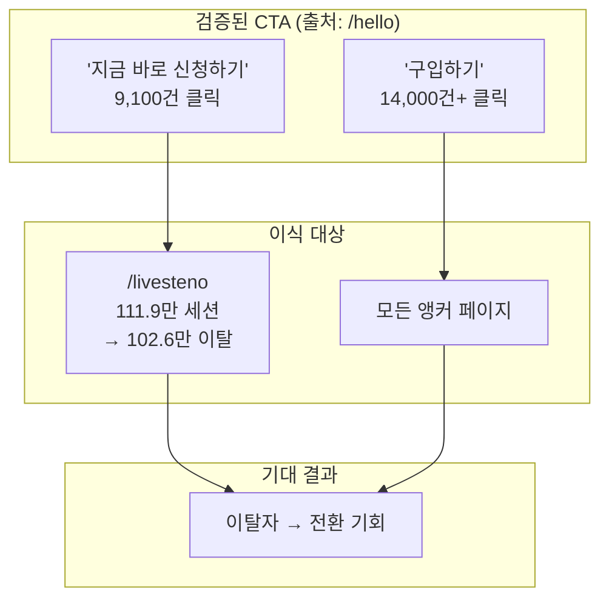

### Frictionless 양식 설계 원칙

| 원칙 | 실행 |
|---|---|
| 입력 단계 최소화 | 필수 필드만 노출, 자동완성 활용 |
| 진행 상태 표시 | 스텝 인디케이터로 완료 감각 부여 |
| 모바일 키보드 최적화 | 입력 타입별 적절한 키보드 호출 |
| 중도 이탈 방지 | 입력 중 이탈 시 데이터 임시 저장 |

---

## 6. 실행 로드맵

### 3대 핵심 과제

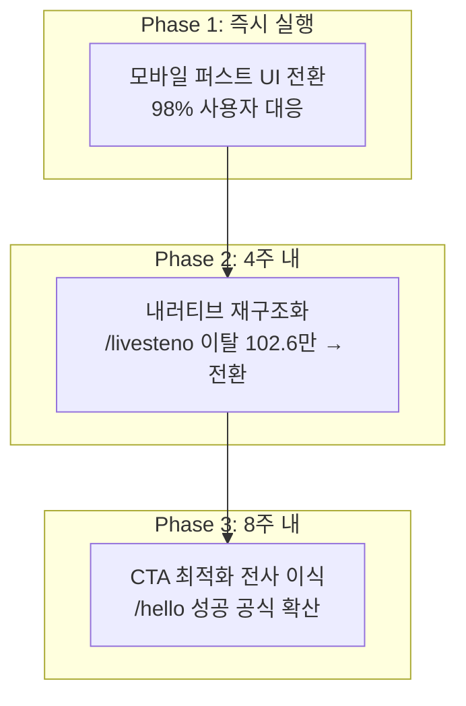

### 과제별 상세

| 과제 | 핵심 액션 | 타겟 지표 | 기대 효과 |
|---|---|---|---|
| 모바일 퍼스트 | 데스크톱 UI 폐기, Thumb-Zone CTA | 반송률 91% → 80% 이하 | 모바일 전환율 상승 |
| 내러티브 재구조화 | /livesteno → /hello 가교, 스토리텔링 흐름 | 세션당 페이지 1.1 → 2.0+ | 체류 시간 회복 |
| CTA 이식 | '신청하기' 버튼 전사 배치, Frictionless 폼 | 양식 제출 +30% 추가 성장 | ROI 극대화 |

### 성공 시 예상 임팩트

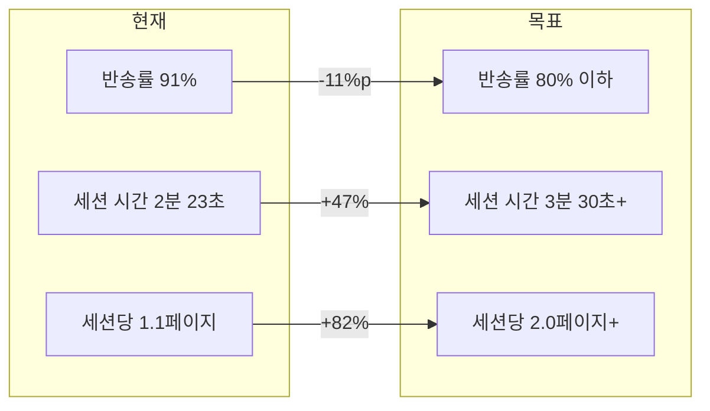

---

## 결론

데이터가 가리키는 방향은 명확하다.

**양적 팽창의 시대는 끝났다. 이제는 질적 최적화의 시대다.**

316.4만 세션과 17,063건의 전환은 매체 최적화의 승리였다. 그러나 91%의 반송률과 102.6만 명의 이탈은, 이 승리가 지속 가능하지 않다는 경고다. /hello에서 검증된 CTA 전략을 /livesteno로 이식하고, 모바일 온리 UX로 전환하며, 페이지 간 내러티브를 연결하는 것 — 이 세 가지가 다음 단계의 핵심 레버리지다.

---

*Growth Marketing Lead · 이세영 · [성과 리포트 보기](2025-website-performance.md) · [README로 돌아가기](../README.md)*
