# 2025 Website Performance Report

**sorizava.com · Annual Traffic and Conversion Analysis**

> 2x Traffic, 10x Conversions — A year driven by mobile and social media

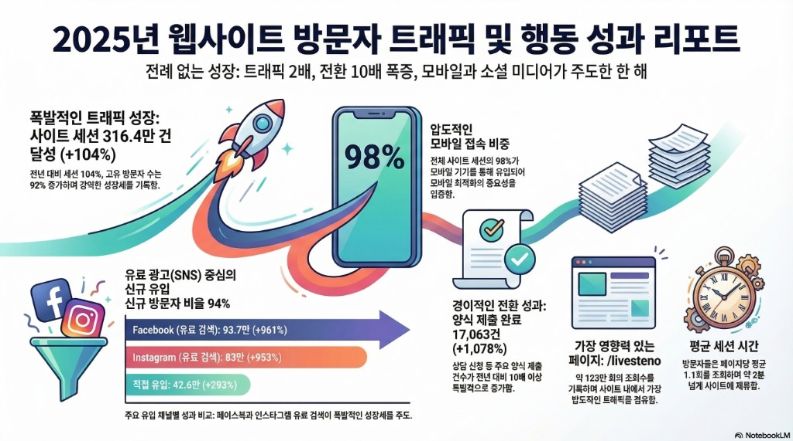

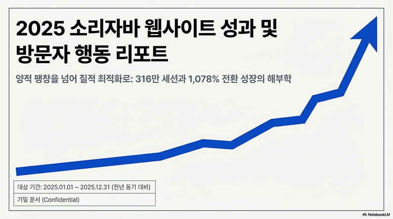

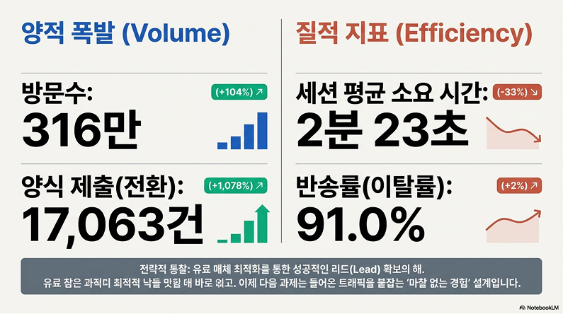

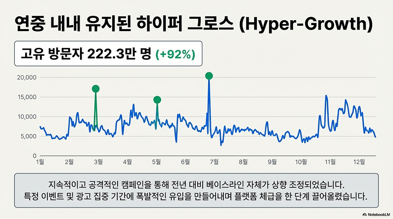

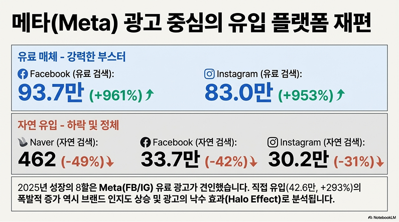

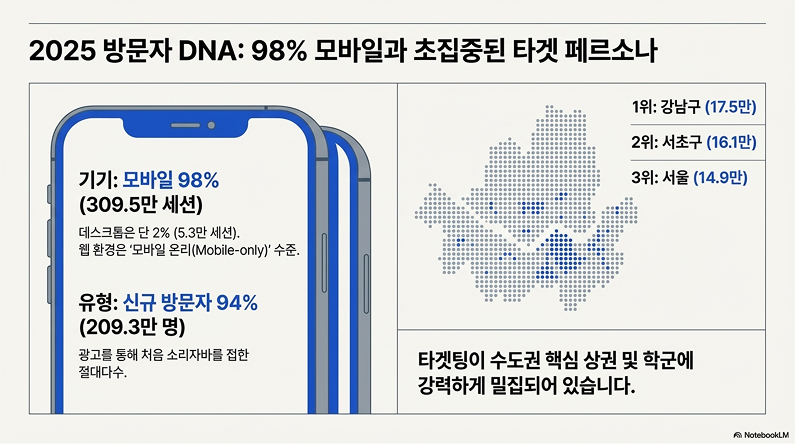

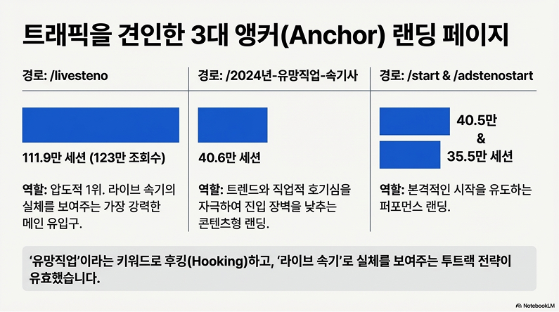

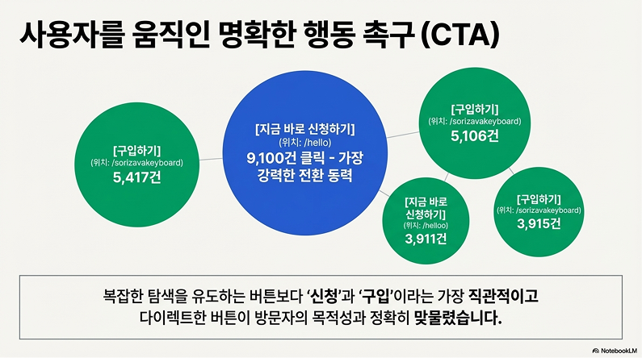

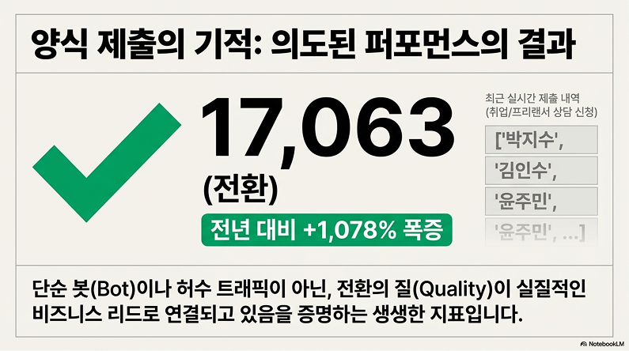

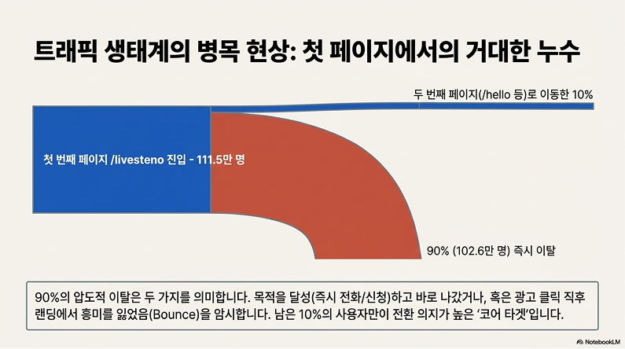

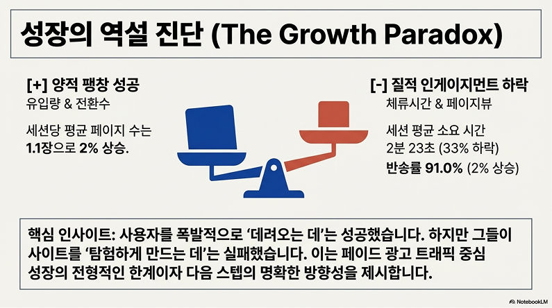

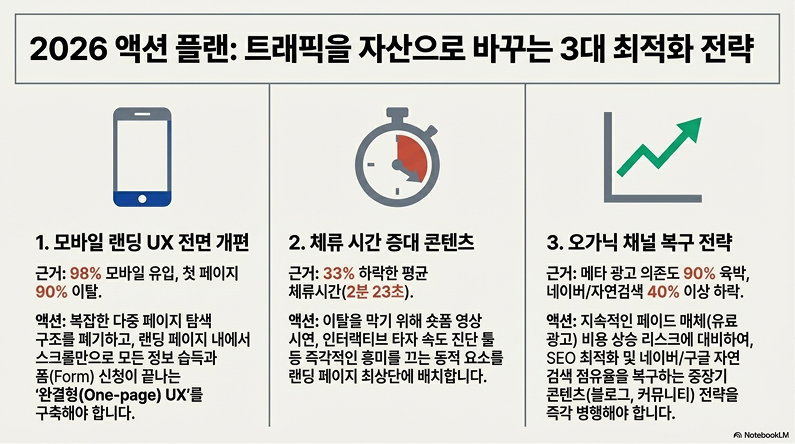

---

## Executive Summary

| Metric | 2024 | 2025 | Change |
|---|---:|---:|---|
| Site Sessions | ~1.55M | **3.16M** | **+104%** |
| Form Submissions (Conversions) | ~1,460 | **17,063** | **+1,078%** |
| Mobile Share | — | **98%** | — |
| New Visitor Ratio | — | **94%** | — |
| Key Page Views (/livesteno) | — | **1.23M+** | — |

While traffic doubled, conversions surged over 10x. This wasn't simply about driving more visitors — it was the result of **aligning the entire media-landing-conversion structure**.

---

## 1. Traffic Analysis

### 3.16M Annual Sessions (+104%)

Sessions grew 104% and unique visitors 92% year-over-year. The core growth drivers were the explosive expansion of Meta paid search channels and stable growth in direct traffic.

**Growth Driver Summary:**

| Rank | Driver | Contribution |
|:---:|---|---|
| 1 | Meta (FB/IG) paid search optimization | ~1,000% channel acquisition increase |
| 2 | /livesteno anchor page launch | Highest traffic concentration on site |
| 3 | Mobile-only landing structure | Optimized for 98% mobile environment |

---

## 2. Channel Performance

### Channel Acquisition Results

Paid social (SNS) drove new user acquisition, with 94% of visitors being new.

| Channel | Volume | YoY Change |
|---|---:|---|
| Facebook (Paid Search) | **937K** | **+961%** |
| Instagram (Paid Search) | **830K** | **+953%** |
| Direct | **426K** | **+293%** |

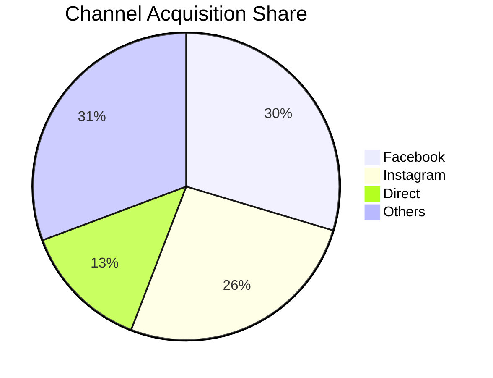

### Channel Strategy Interpretation

- **Facebook (+961%)** — Restructured paid search campaigns with refined audience segmentation. Focused on key metropolitan personas to improve CPC efficiency while simultaneously scaling volume.
- **Instagram (+953%)** — Leveraged creative formats (Reels, Stories) within the same Meta platform for awareness campaigns, connecting them to search-driven conversions.
- **Direct (+293%)** — A result of rising brand awareness. The flow from paid ad exposure → brand recall → direct visit was established.

---

## 3. Device & Audience

### 98% Mobile

98% of all sessions came through mobile devices, proving the critical importance of mobile optimization.

| Device | Share |
|---|---:|
| Mobile | **98%** |
| Desktop + Tablet | 2% |

Building mobile-only landing pages to match this distribution was the most important structural foundation for conversion growth.

### 94% New Visitors

The media strategy was focused on new user acquisition through paid social, with 94% being first-time visitors. This demonstrates effective media execution during the service awareness expansion phase.

---

## 4. Conversion Funnel

### 17,063 Form Submissions (+1,078%)

Key form submissions including consultation requests surged over 10x year-over-year.

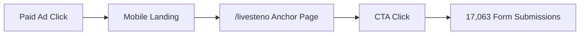

### Conversion Analysis

| Segment | Metric | Note |
|---|---|---|
| Ad → Landing | 91% Bounce Rate | Immediate exit after ad click |
| Landing → Conversion | +1,078% Conversions | After /livesteno anchor page launch |

Traffic grew 2x while conversions grew 10x+. This means **both volume increase and conversion structure improvement worked simultaneously**.

### Bottleneck Resolution

| Before | After |
|---|---|
| Ad click → Generic homepage → Information overload → Exit | Ad click → /livesteno purpose-driven page → Immediate CTA → Conversion |
| Conversion loss at 91% bounce rate segment | Shortened conversion path with direct CTA placement |

---

## 5. Key Page: /livesteno

### Most Impactful Page on Site

| Metric | Value |
|---|---:|
| Total Page Views | **1.23M+** |
| Site Traffic Share | Highest |

/livesteno was designed as a **purpose-driven anchor page** to address the 91% bounce rate problem.

**Design Principles:**

1. **Eliminate exploration burden** — Deliver core information on a single page without requiring users to navigate multiple pages
2. **Immediate action triggers** — Minimize the path to signup/purchase conversion with intuitive CTA placement
3. **Mobile optimization** — Seamless experience designed for the 98% mobile environment

This single page was the structural center of 10x conversion growth.

---

## 6. Session Behavior

| Metric | Value |
|---|---:|
| Average Pages per Session | **1.1 pages** |
| Average Session Duration | **~2 minutes** |

Visitors viewed an average of 1.1 pages and stayed on site for about 2 minutes. The low page view count is not a negative signal — it demonstrates the **anchor page strategy working as intended** — users got the information they needed on one page and moved directly to conversion actions.

---

## 7. Insights & Lessons

### Insight 1: Conversion structure matters more than traffic growth

Traffic +104% vs Conversions +1,078%. Conversions growing 5x faster under the same budget structure proves that landing structure improvement has greater leverage than media optimization.

### Insight 2: Mobile-only design is a prerequisite, not an option

In an environment where 98% is mobile, responsive design is insufficient. CTA placement, form length, and loading speed must be designed from a **mobile-only** perspective, not just mobile-first.

### Insight 3: Anchor pages are a structural solution to bounce rate problems

The 91% bounce rate was not a content problem — it was a **structure problem**. When the landing page doesn't align with user intent after an ad click, no amount of good content prevents exits. The /livesteno anchor page solved this structurally.

### Insight 4: Meta paid search drives brand awareness too

As Facebook/Instagram paid search grew ~1,000%, direct traffic grew +293% alongside it. Paid ads had an effect beyond click acquisition — they accumulated brand awareness.

### Insight 5: Media-Landing-Conversion alignment is the core framework

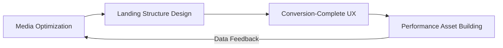

When any of the three elements is misaligned, budgets are wasted. The 2025 results are the compounding effect that occurs when all three elements align simultaneously.

---

## Methodology

| Item | Detail |
|---|---|
| Analysis Period | January – December 2025 (Full Year) |
| Data Source | Google Analytics (GA4) |
| Comparison Basis | Year-over-Year vs 2024 |
| Key Metrics | Sessions, form submissions, channel acquisition, device, page views |
| Target Site | sorizava.com |

---

*Growth Marketing Lead · Seyoung Lee · [Back to README](../README_EN.md)*
