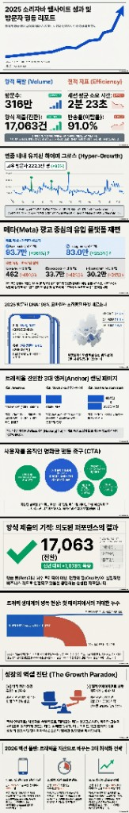
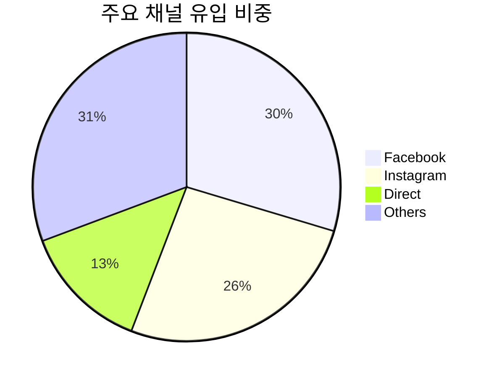
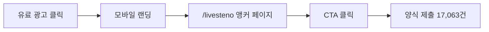
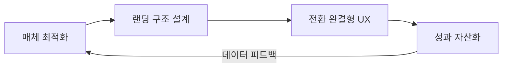

# 2025 Website Performance Report

**sorizava.com · 연간 트래픽 및 전환 성과 분석**

> 트래픽 2배, 전환 10배 — 모바일과 소셜 미디어가 주도한 한 해

<strong>상세 리포트 전체 보기 (클릭)</strong>

 

---

## Executive Summary

| 지표 | 2024 | 2025 | 변화 |
|---|---:|---:|---|
| 사이트 세션 | ~155만 | **316.4만** | **+104%** |
| 양식 제출(전환) | ~1,460건 | **17,063건** | **+1,078%** |
| 모바일 비중 | — | **98%** | — |
| 신규 방문자 비중 | — | **94%** | — |
| 주요 페이지 조회 (/livesteno) | — | **123만+** | — |

트래픽이 2배 증가하는 동안 전환은 10배 이상 폭증했다. 이는 단순한 유입 확대가 아니라 **매체-랜딩-전환 구조 전체의 정렬**이 만들어낸 결과다.

---

## 1. Traffic Analysis

### 연간 세션 316.4만 달성 (+104%)

전년 대비 세션 104%, 고유 방문자 수 92% 증가를 기록했다. 성장의 핵심 동력은 Meta 유료 검색 채널의 폭발적 확대와 직접 유입의 안정적 성장이었다.

**성장 드라이버 요약:**

| 순위 | 드라이버 | 기여 |
|:---:|---|---|
| 1 | Meta(FB/IG) 유료 검색 최적화 | 채널 유입 약 1,000% 증가 |
| 2 | /livesteno 앵커 페이지 신설 | 사이트 내 최다 트래픽 집중 |
| 3 | 모바일 전용 랜딩 구조 전환 | 98% 모바일 환경에 최적화 |

---

## 2. Channel Performance

### 채널별 유입 성과

유료 광고(SNS) 중심의 신규 유입이 전체 성장을 견인했으며, 신규 방문자 비율이 94%에 달했다.

| 채널 | 유입량 | YoY 변화 |
|---|---:|---|
| Facebook (유료 검색) | **93.7만** | **+961%** |
| Instagram (유료 검색) | **83만** | **+953%** |
| 직접 유입 | **42.6만** | **+293%** |

### 채널 전략 해석

- **Facebook (+961%)** — 유료 검색 캠페인 구조 재설계와 타겟 오디언스 세분화가 핵심. 수도권 핵심 페르소나에 집중 공략하여 CPC 효율을 높이면서 볼륨을 동시에 확장했다.
- **Instagram (+953%)** — Facebook과 동일한 Meta 플랫폼 내에서 크리에이티브 포맷(릴스, 스토리)을 활용한 인지 확대 캠페인을 병행. 검색 유입 전환으로 연결했다.
- **직접 유입 (+293%)** — 브랜드 인지도 상승의 결과. 유료 광고 노출 → 브랜드 기억 → 직접 검색/방문 흐름이 형성된 것으로 판단한다.

---

## 3. Device & Audience

### 모바일 98%

전체 사이트 세션의 98%가 모바일 기기를 통해 유입되어, 모바일 최적화의 중요성을 입증했다.

| 디바이스 | 비중 |
|---|---:|
| Mobile | **98%** |
| Desktop + Tablet | 2% |

이 비중에 대응하여 모바일 전용 랜딩 페이지를 구축한 것이 전환 성장의 가장 큰 구조적 기반이었다.

### 신규 방문자 94%

유료 광고(SNS) 중심의 매체 전략이 신규 사용자 확보에 집중되어 있었으며, 94%가 신규 방문자였다. 이는 서비스 인지 확대 단계에서 효과적인 매체 집행이 이루어졌음을 보여준다.

---

## 4. Conversion Funnel

### 양식 제출 17,063건 (+1,078%)

상담 신청 등 주요 양식 제출 건수가 전년 대비 10배 이상 특발적으로 증가했다.

### 전환율 분석

| 구간 | 지표 | 비고 |
|---|---|---|
| 광고 → 랜딩 | 반송률 91% | 광고 클릭 직후 이탈 비율 |
| 랜딩 → 전환 | 전환 +1,078% | /livesteno 앵커 페이지 도입 후 |

트래픽은 2배 증가했지만 전환은 10배 이상 증가했다. 이는 **유입량 증가와 전환 구조 개선이 동시에 작동**했음을 의미한다.

### 병목 해소 전략

| Before | After |
|---|---|
| 광고 클릭 → 일반 홈페이지 → 정보 탐색 부담 → 이탈 | 광고 클릭 → /livesteno 목적 지향 페이지 → 즉각 CTA → 전환 |
| 반송률 91% 구간에서 전환 손실 | CTA 직접 배치로 전환 경로 단축 |

---

## 5. Key Page: /livesteno

### 사이트 내 가장 영향력 있는 페이지

| 지표 | 수치 |
|---|---:|
| 총 조회수 | **123만+** |
| 사이트 내 트래픽 점유 | 최다 |

/livesteno는 91%에 달하는 반송률 문제를 해결하기 위해 설계한 **목적 지향적 앵커 페이지**다.

**설계 원칙:**

1. **정보 탐색 부담 제거** — 사용자가 여러 페이지를 돌아다닐 필요 없이 한 페이지에서 핵심 정보를 전달
2. **즉각적 행동 유도** — 직관적 CTA 배치로 신청/구입 전환까지의 경로를 최소화
3. **모바일 최적화** — 98% 모바일 환경에서 끊김 없는 경험 설계

이 페이지 하나가 전환 10배 성장의 구조적 중심이었다.

---

## 6. Session Behavior

| 지표 | 수치 |
|---|---:|
| 페이지당 평균 조회 | **1.1페이지** |
| 평균 세션 시간 | **약 2분** |

방문자들은 평균 1.1회 페이지를 조회하며 약 2분 넘게 사이트에 체류했다. 페이지 뷰 수가 낮은 것은 부정적 신호가 아니라, **앵커 페이지 전략이 의도대로 작동**했음을 보여준다 — 사용자가 한 페이지에서 필요한 정보를 얻고 바로 전환 행동으로 넘어간 것이다.

---

## 7. Insights & Lessons

### Insight 1: 트래픽 성장보다 전환 구조가 더 중요하다

트래픽 +104% vs 전환 +1,078%. 동일한 예산 구조에서 전환이 5배 빠르게 성장한 것은 랜딩 구조 개선의 레버리지가 매체 최적화보다 크다는 것을 증명한다.

### Insight 2: 모바일 전용 설계는 선택이 아니라 전제다

98%가 모바일인 환경에서 반응형(responsive) 접근은 부족하다. 모바일 퍼스트가 아니라 **모바일 온리** 관점에서 CTA 위치, 폼 길이, 로딩 속도를 설계해야 한다.

### Insight 3: 앵커 페이지는 반송률 문제의 구조적 해법이다

91% 반송률은 콘텐츠 문제가 아니라 **구조 문제**였다. 광고 클릭 후 도착하는 페이지가 사용자의 의도와 정렬되지 않으면, 아무리 좋은 콘텐츠도 이탈을 막지 못한다. /livesteno 앵커 페이지는 이 문제를 구조적으로 해결했다.

### Insight 4: Meta 유료 검색은 브랜드 인지까지 견인한다

Facebook/Instagram 유료 검색 유입이 약 1,000% 증가하면서, 직접 유입도 +293% 동반 성장했다. 유료 광고가 단순 클릭 획득을 넘어 브랜드 인지도를 축적하는 효과가 있었다.

### Insight 5: 매체-랜딩-전환 정렬이 핵심 프레임워크다

세 가지 중 하나라도 어긋나면 예산은 낭비된다. 2025년 성과는 이 세 요소가 동시에 정렬되었을 때 발생하는 복합 효과(compounding effect)의 결과다.

---

## Methodology

| 항목 | 내용 |
|---|---|
| 분석 기간 | 2025년 1월 ~ 12월 (연간) |
| 데이터 소스 | Google Analytics (GA4) |
| 비교 기준 | 전년 동기 (2024년) 대비 YoY |
| 주요 지표 | 세션, 양식 제출, 채널별 유입, 디바이스, 페이지 조회 |
| 대상 사이트 | sorizava.com |

---

*Growth Marketing Lead · 이세영 · [README로 돌아가기](../README.md)*
